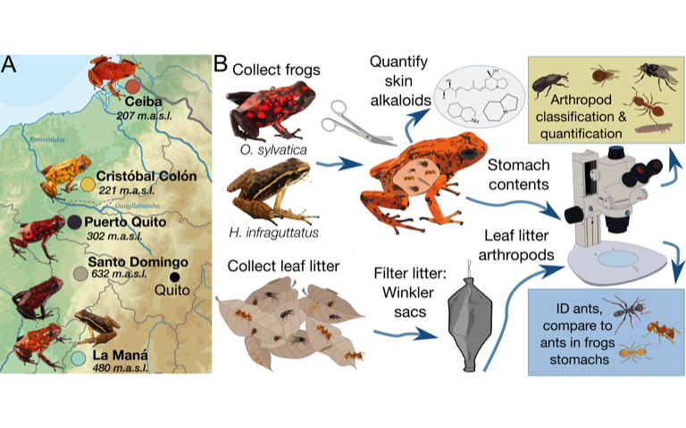
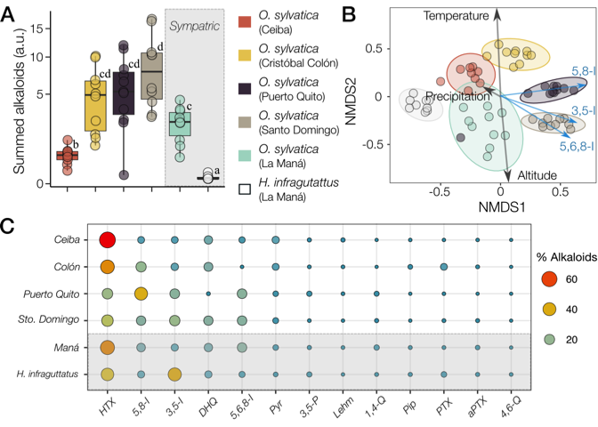
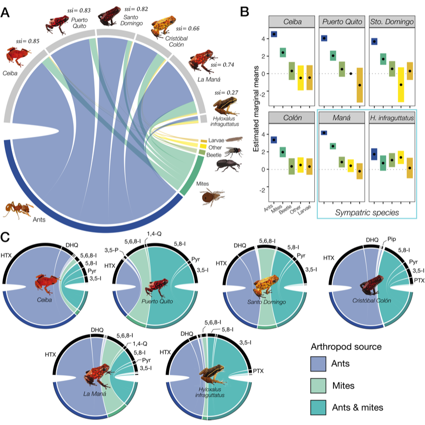
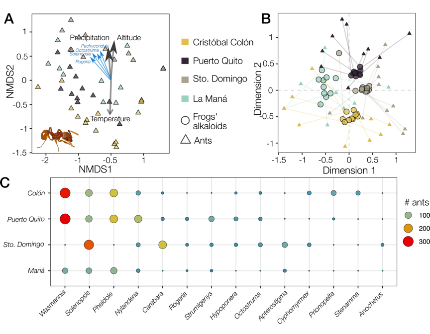
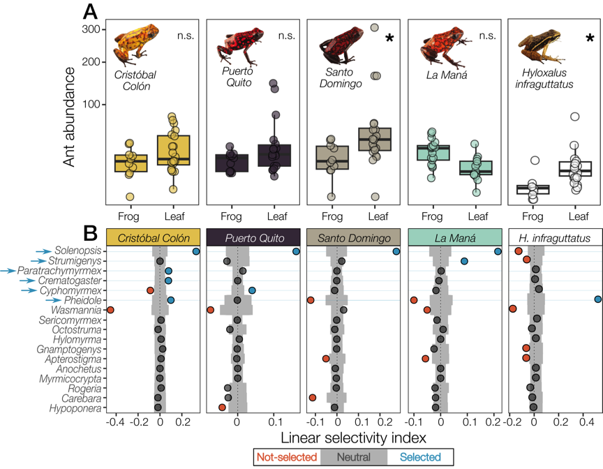
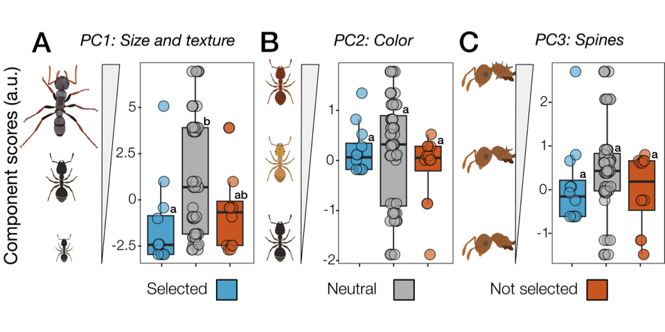

# Poison frog chemical defenses are influenced by environmental availability and dietary selectivity for ants


Nora A. Martin†¹, Camilo Rodríguez†¹, Aurora Alvarez-Buylla¹, Katherine
Fiocca¹, Colin R. Morrison², Adolfo Chamba-Carrillo³, Ana B.
García-Ruilova⁴, Janet Rentería⁵, Elicio E. Tapia⁶, Luis A. Coloma⁶,
David A. Donoso\*⁷⁺⁸, Lauren A. O’Connell\*¹<br><br>

¹ Department of Biology, Stanford University, Stanford, CA 94305,
USA<br> ² Department of Integrative Biology, The University of Texas at
Austin, Austin, TX 78712, USA<br> ³ Programa de Posgrado en
Biodiversidad y Cambio Climático, Universidad Indoamérica, Quito,
Ecuador<br> ⁴ División de Entomología, Instituto Nacional de
Biodiversidad, Pje. Rumipamba N. 341 y Av. de los Shyris, Quito,
Ecuador<br> ⁵ School of Biological Sciences, University of Bristol,
Bristol, UK <br> ⁶ Centro Jambatu de Investigación y Conservación de
Anfibios, Fundación Otonga, San Rafael, Quito, Ecuador<br> ⁷
Departamento de Biología, Escuela Politécnica Nacional, Ladrón de
Guevara E11-253, Quito, Ecuador<br> ⁸ Grupo de Investigación en Ecología
y Evolución en los Trópicos -EETrop-, Universidad de las Américas,
Quito, Ecuador<br><br>

† Joint first authorship<br> \* Corresponding authors:
<a href="mailto:david.donosov@gmail.com">david.donosov@gmail.com</a>,
<a href="mailto:loconnel@stanford.edu">loconnel@stanford.edu</a>

</div>


# Abstract

> [!NOTE]
>
> The ability to use small molecule alkaloids as defensive chemicals,
> often acquired via trophic interactions, has evolved in many
> organisms. Animals with diet-derived defenses must balance food
> choices to maintain their defense reservoirs along with other
> physiological needs. Poison frogs accumulate skin alkaloids from their
> arthropod diet, but whether they show preference for specific prey
> remains unexplored. Here, we explore the role of leaf litter prey
> availability and diet preferences in shaping poison frog chemical
> defenses along a geographic gradient. We examined skin alkaloid
> composition, stomach contents and leaf litter ants in aposematic
> diablito frogs (*Oophaga sylvatica*) at five sites in northwestern
> Ecuador, and in sympatric, cryptic Chimbo rocket frogs (*Hyloxalus
> infraguttatus*) at one site. We found that differential availability
> of leaf litter ants influenced alkaloid profiles across diablito
> populations, and low levels of alkaloids were observed in the
> sympatric, ‘undefended’ Chimbo rocket frog. Ants were the primary
> dietary component of the defended species, while ‘undefended’ species
> ate other prey categories including beetles and larvae in addition to
> ants. A prey selection analysis suggested that defended and
> ‘undefended’ frogs both feed on a high proportion of specific small
> ant genera that naturally contain alkaloids, suggesting that
> selectivity for toxic prey is not restricted to classically aposematic
> and highly toxic species. These findings suggest that poison frogs’
> use of feeding resources relative to availability may be an
> understudied and important selection factor in the evolution of
> acquired defenses.

# Introduction

Many organisms use chemical defenses to protect themselves from
predators or pathogens \[@mebs2002\]. These defenses often involve small
molecule alkaloids synthesized by plants or microbes, and some taxa can
acquire them through dietary sequestration \[@roberts_alkaloids_1998;
@agrawal_toxic_2012; @santos2016\]. Phytophagous insects represent the
most well-studied taxa, including some species that specialize in
particular plant species and accumulate specific secondary metabolites
for chemical communication or defense \[@roberts_alkaloids_1998;
@walsh2017; @beran2022\]. Although our understanding of chemical defense
in vertebrates is more sparse than invertebrates, poison frogs are a
well known example of chemical defenses acquired through an
arthropod-based diet \[@savitzky2012\]. A key component of poison frog
diets includes alkaloid-rich arthropods, and these frogs have evolved
the physiological mechanisms to tolerate and integrate the toxin in
their tissues to deter predators \[@alvarez-buylla2023\]. Yet, it
remains unclear whether the ecological principles underlying arthropod
diet specialization on toxic plants also apply to vertebrates that
sequester their chemical defenses from arthropods.

The chemical repertoire of alkaloid-defended species varies within and
between populations. For example, the composition and concentration of
piperidine alkaloids in the Norwegian spruce (*Picea abies*) differ by
location \[@virjamo2016\], while in fire ants (*Solenopsis spp.*) vary
within species \[@deslippe2000\]. In species with acquired chemical
defenses, variation in alkaloid profiles is generally attributed to
spatio-temporal shifts in the availability of alkaloid-containing food,
often resulting from environmental variation in temperature, rainfall,
and other climatic factors. For instance, in Argentine
*Melanophryniscus* toads \[@daly2007\], Malagasy *Mantella laevigata*
frogs \[@moskowitz2018\], and various species of Neotropical poison
frogs (Family Dendrobatidae) \[@saporito_geographic_2006;
@saporito_spatial_2007; @moskowitz_land_2020; @prates2019\], differences
in the composition of skin alkaloids across localities and seasons
correspond with differences in stomach contents and leaf litter
arthropod communities. Dietary selectivity may also influence the
alkaloid profile of chemically defended species by favoring the
consumption of food items that contain specific defensive alkaloids.
Yet, organisms must make dietary decisions based on handling time and
nutritional value, in addition to food availability and maintenance of
chemical defenses. For instance, *Chiasmocleis leucosticta* frogs
preferred smaller ants over larger, more aggressive genera
\[@meurer2021\], while lab-reared non-toxic *Dendrobates tinctorius*
preferred protein-rich larvae over other prey types including ants
\[@moskowitz2022\]. As these studies suggest, variation in the
environment, the availability of alkaloid-containing prey, prey
phenotype and foraging behavior are likely important factors in
diet-acquired defense evolution. However, there is limited understanding
of how these factors interact to influence species’ food choices and
their ability to sequester chemical defenses from specific dietary
sources.

Neotropical poison frogs acquire alkaloids from alkaloid-containing
arthropods rather than synthesizing them de novo \[@daly1994\]. Chemical
defenses in dendrobatids have evolved independently at least four times
in parallel with dietary specialization on ants and mites \[@santos2003;
@darst2005\]. However, recent evidence suggests that diet specialization
alone does not explain the defended phenotype, as ‘undefended’ species
often consume alkaloid-containing arthropods and have low but detectable
alkaloid levels \[@sanches_what_2023; @tarvin_passive_2024\]. Yet, it is
unclear if selectivity for specific alkaloid-containing prey plays a
role in the ability of poison frogs to dietarily acquire their chemical
defenses, as most studies focus on diet without assessing environmental
availability of arthropod prey \[@mcelroy_ant_2019\]. This is especially
important as temporal and geographic variations in abiotic factors such
as temperature, altitude, and precipitation affect the composition and
richness of leaf litter arthropod communities \[@brühl1999; @silva2014;
@gibb2015; @tiede2017; @hoenle2022; @basset2023\]. Thus, we currently
lack a framework for understanding the evolution of diet-acquired
defenses in poison frogs, as the role of prey availability in diet
specialization has not been studied in depth.

Here, we tested whether dendrobatid poison frogs that acquire chemical
defenses from their diet exhibit dietary prey selectivity for
alkaloid-containing prey. To test this hypothesis, we sampled stomach
contents, skin alkaloids, and surrounding leaf litter ant communities
from five populations of the aposematic, chemically defended *Oophaga
sylvatica* and one sympatric population of the cryptic, chemically
‘undefended’ *Hyloxalus infraguttatus*. We compared skin alkaloid
profiles among poison frog populations along a geographical gradient,
predicting intraspecific variation linked to environmental factors, such
as altitude, temperature and precipitation, and higher alkaloid
composition in the sympatric defended species. We compared stomach
contents across poison frog populations and predicted within and between
species variation, where chemically defended frogs would eat more ants
and mites than ‘undefended’ ones. We sorted ants to genus level from
stomachs and leaf litter, characterized their morphology, and predicted
that sympatric defended and ‘undefended’ frogs will show distinct
dietary selectivity for ant genera despite access to the same ant
communities. We further predicted that differences in ant communities
across localities correspond with differences in chemical defense
between poison frogs. Together, our between- and within-species
comparisons of poison frog stomach contents and prey availability aim to
disentangle the relationship between dendrobatid diet and alkaloid
acquisition, which has broader implications for our general
understanding of trophic interactions and the evolution of chemical
defenses across taxa.

<div id="fig-1">



Figure 1: Map of frog populations and experimental workflow. **(A)**
Collection sites are shown on a topographic map of western Ecuador. Note
that both *Hyloxalus infraguttatus* and *Oophaga sylvatica* were
collected from La Maná. m.a.s.l. = meters above the sea level. **(B)** A
flowchart depicts the main steps of data collection for frog stomach
content and leaf litter samples, in order to compare ant genera
abundances between these groups.

</div>

<a
href="https://drive.google.com/open?id=1oz7vn6lXDQIToIUbWO45K2Yb2mEjzmmm&amp;usp=drive_fs"
class="external" target="_blank">Figure 1.</a>

# Methods

## Study system and sample collection

Diablito frogs (*Oophaga sylvatica*) were collected in May 2019, during
daylight in secondary forests near the towns of Ceiba (N=10; 207
m.a.s.l), Cristóbal Colón (N=11; 221 m.a.s.l), Puerto Quito (N=11; 302
m.a.s.l), Santo Domingo de los Tsáchilas (N=10; 632 m.a.s.l), and La
Maná (N=20; 480 m.a.s.l), in Northwestern Ecuador
(<a href="#fig-1" class="quarto-xref">Figure 1</a> A). As *O. sylvatica*
suffers from illegal poaching for the pet trade, coordinates for
collection can be obtained from the corresponding authors. Chimbo rocket
frogs (*Hyloxalus infraguttatus*) were collected during daylight from La
Maná (N=9). While behavioral observations were not performed, frogs were
collected during active foraging hours (06:00 - 19:00)
\[@funkhouser1956; @amphibia2025\]. Frogs were anesthetized 3 – 6 hours
after collection with 20% benzocaine gel applied to the ventral skin and
euthanized. For each individual, the dorsal skin was dissected and
stored in methanol in glass vials. The stomach contents were stored in
100% ethanol in 1.5 ml plastic tubes. Remaining frog tissues were either
preserved in 100% ethanol or RNAlater (Thermo Scientific, Waltham, MA,
USA), or deposited in the amphibian collection of Centro Jambatu de
Investigación y Conservación de Anfibios in Quito, Ecuador. Collections
and exportation of specimens were done under permits (Collection permit:
No. 0013-18 IC-FAU-DNB/MA; Export permit:
No. 214-2019-EXP-CM-FAU-DNB/MA; CITES export permit No. 19EC000036/VS)
issued by the Ministerio de Ambiente de Ecuador. The Administrative
Panel on Laboratory Animal Care of Stanford University approved all
frog-related procedures (Protocol \#34153).

## Alkaloid extraction and quantification

Skins were removed from methanol with forceps and weighed. From the
methanol in which the skin was stored, 1 ml was syringe filtered through
a 0.45 um PTFE filter (Thermo Scientific, 44504-NP) into the new glass
vial (Wheaton, PTFE caps, 60940A-2) supplemented with 25 ug (-)-nicotine
(Sigma Aldrich, N3876-100ML). All tubes were then capped, vortexed, and
stored for 24 hours at -80ºC to precipitate lipids and proteins. After
precipitating for 24 hours, the supernatant was filtered through a 0.45
um PTFE syringe filter into a new glass vial. A 100 uL aliquot was added
to a gas chromatography/mass spectrometry (GC/MS) autosampler vial, and
the remaining solution was stored at -80ºC.

Alkaloid detection was performed using gas chromatography-mass
spectrometry (GC-MS) following the protocol described elsewhere
\[@saporito2010; @alvarez-buylla2023\], and using a Shimadzu GCMS-QP2020
instrument with a Shimadzu 30m x 0.25 mmID SH-Rxi-5Sil MS column. In
brief, the separation of alkaloids was achieved with helium as the
carrier gas (flow rate: 1 mL/min) using a temperature program increasing
from 100 to 280°C at a rate of 10°C/minute. This was followed by a
2-minute hold and an additional ramp to 320°C at a rate of 10°C/minute
for column protection reasons, and no alkaloids appeared during this
part of the method. Compounds were analyzed with electron impact-mass
spectrometry (EI-MS). The GC-MS data files were exported as .CDF files,
and the Global Natural Products Social Molecular Networking (GNPS)
software was used to perform the deconvolution and library searching
against the AMDIS (NIST) database to identify all compounds \[@wang2016;
@aksenov2021\]. For deconvolution (identification of peaks and abundance
estimates), the default parameters were used. Through the deconvolution
process, molecular features were reported as rows/observations, while
m/z intensities were reported as columns/variables. Automatic library
search was obtained from reference libraries of natural products (NIST,
Wiley, University of CORSICA, GNPS), and our resulting dataset was
filtered to keep only the nicotine standard and alkaloids previously
found in poison frogs or compounds with the same base ring structure and
R group positions as those classes defined in the Daly poison frog
alkaloid database \[@daly2005\]. Once the feature table from the GNPS
deconvolution was filtered to include only poison frog alkaloids and
nicotine, the abundance values (ion counts) were normalized by dividing
by the nicotine standard and skin weight. The resulting filtered and
normalized feature table was used for all further analyses and
visualizations.

## Frog stomach contents identification

Whole stomachs were stored in 100% ethanol at -20ºC until processing.
Stomach contents were sorted and photographed. Prey items in the
photographs were identified to the lowest possible taxonomic rank and
then grouped into broad diet categories: ants, mites, larvae, beetles,
and “other” (i.e., any non-larval arthropods not described by the other
four groups). Note that most larvae belong to Dipteran or Coleopteran
taxa, but are considered in our distinct “larvae” category given their
differences in appearance from adults. The vast majority of identifiable
prey remained whole, with the exception of ants, whose heads frequently
detached from their bodies upon ingestion. To prevent overcounting, only
whole ant specimens, partial ant specimens with heads, or individual ant
heads were counted. Ant specimens were identified to genus using a
reference collection of Ecuadorian ants \[@donoso2009; @salazar2015;
@donoso2017\].

## Leaf litter communities and ant morphology

Leaf litter samples were extracted and collected using 18 - 20 Winkler
sacs from all localities except for La Ceiba due to time and resource
limitations. Samples were collected in May–June 2019 within one square
meter of where a frog had been previously collected that day. Leaf
litter arthropods were extracted from 1 m2 and hung within Winkler sacs
for 24 hours, during which the arthropods were collected into 70%
ethanol. Only ants were identified, as described above. Collection of
ant specimens was done under permits issued by the Ministerio de
Ambiente de Ecuador to Museo de Historia Natural Gustavo Orcés at
Escuela Politécnica Nacional (MAE-DNB-CM-2017-0068). Ant morphology was
characterized by 17 traits related to size, texture, spine count, and
coloration for leaf litter ant genera that were also found in frog
stomach contents. Morphological traits were measured at the species
level using data from the Global Ants Database, which provides
standardized trait information across ant species \[@parr2017\].

## Data Analysis

All statistics and figures were generated in R Studio (version 1.1.442)
running R (version 3.5.2).

``` r
library(Hmisc)
library(corrr)
library(corrplot)
library(bipartite)
library(sjPlot)
library(sjmisc)
library(sjlabelled)
library(sjtable2df)
library(caret)
library(MASS)
library(ggplot2)
library(emmeans)      ## estimated marginal means (least-squares means)
library(lmerTest)     ## p-values for lme4 models
library(lme4)         ## Mixed models 
library(lmtest)
library(MuMIn)
library(ggpubr)
library(nlme)
library(GGally)
library(PerformanceAnalytics)
library(psych)
library(knitr)
library(performance)
library(see)
library(viridis)       ## Viridis colour palette
library(car)
library(mvnTest)
library(rstatix)       ## different analyses (e.g., pairwise.t.test, Dunn's test)
library(FSA)           ## alternative for Dunn's test
library(repmis)
library(tidyverse)     ## the tidyverse
library(vegan)         ## Ordination, dissimilarity analyses
library(colorspace)    ## adjust colors
library(rcartocolor)   ## Carto palettes
library(ggforce)       ## sina plots
library(ggdist)        ## halfeye plots
library(ggridges)      ## ridgeline plots
library(ggbeeswarm)    ## beeswarm plots
library(gghalves)      ## off-set jitter
library(systemfonts)   ## custom fonts
library(kableExtra)
library(ggh4x)
library(ape)            
library(wesanderson)    ## Colour palette
library(grid)
library(png)
library(devtools)
library(pairwiseAdonis)
library(reshape2)       ## function melt
library(readr)          ## to export kable
library(rptR)           ## Repeatability
library(DescTools)
library(igraph)
library(remotes)
library(tinytable)
library(stats)
library(ggcorrplot)
library(glmmTMB)
library(DHARMa)
library(dietr)
library(FactoMineR)
library(factoextra)
library(modeldb)
library(ade4)
library(conflicted)
library(ggsankey)
library(raster)
library(circlize)
library(scico)
library(magrittr)

conflicts_prefer(dplyr::select)# Will prefer dplyr::select over any other package. 

conflicts_prefer(dplyr::filter)# Will prefer dplyr::filter over any other package. 

conflicts_prefer(base::attr)

conflicts_prefer(dplyr::summarize)

conflicts_prefer(dplyr::mutate)

conflicts_prefer(dplyr::rename)

conflicts_prefer(dplyr::summarise)

conflicts_prefer(base::union)

conflicts_prefer(magrittr::set_names)
```

All data sets used for this analyses can be accessed in:
<https://drive.google.com/open?id=1d0iVHDFW4sX9hHQyasMv9oO-aWF1Ff_5&usp=drive_fs>

``` r
#Alkaloid feature table
feat_tab <- read.csv('featureTableY_normalized.csv')

#Alkaloid diversity 
alkadiver <- read.csv("alkadiver.csv") #has compositional differences in skin alkaloid profiles between *O. sylvatica* populations and *H.infragutatus*, and altitude for every locality.

#Abundance of ant genera
L_antdiver <- read.csv("L_antdiver.csv")#has the abundance of all ant genera collected from the leaf litter and from frogs' stomach contents in every locality.

#Diet
diet <- read.csv("diet.csv")#has the type and number of prey items found in the stomach contents of frog individuals from all populations.


#ant traits 
ant_traits <- read.csv("ant_traits.csv")#has 17 morphological traits of all ant genera collected from the leaf litter in every locality.


#Abundance all ants
ant_all <- read.csv("ant_all.csv") # has abundance of all ant species captured in pitfall and Winkler traps for every place.
```

### Alkaloid comparisons

We used a Kruskal-Wallis test to examine overall differences between *O.
sylvatica* and *Hyloxalus infraguttatus* populations in summed toxicity
across the 79 alkaloids in the 13 structural families. A pairwise
Wilcoxon test was used to determine *O. sylvatica* population
differences between the 13 structural families in both species, with
p-values adjusted for multiple testing using the False Discovery Rate
control (FDR).

``` r
#Kruskal-Wallis test to compare skin alkaloids accross populations
kw_test <- alkadiver %>% 
  select(-latitude, -longitude, -altitude) %>% 
  mutate(total = select(., contains(".")) %>%
           rowSums(na.rm = TRUE)) %>% 
  do(tidy(kruskal.test(.$total ~ .$population)))

###-------------------------##
## NMDS for skin alkaloids ##
##-------------------------##

#the ordination was performed using Bray-Curtis dissimilarities
ord <- metaMDS((alkadiver %>% 
  select(where(is.numeric), -altitude, -latitude, -longitude)), 
  perm=9999, distance = "bray", 
               k = 2, autotransform = FALSE)

#the ordination was ran a second time starting at the previous best solution to ensure the stability and reliability of the results in the NMDS 
ord2<-metaMDS((alkadiver %>% 
  select(where(is.numeric), -altitude, -latitude, -longitude)), previous.best = TRUE)


#Include environmental variables 

# Create a vector with the "environmental variables" 
#For this I will use the coordinates of every locality and extract average historical temperature and precipitation, in addition to altitude, from World Clim.  

# Load average temperature and precipitation rasters from : https://www.worldclim.org/data/worldclim21.html 

# Adjust this path accordingly:

#My_Mac
#prec <- stack('/Users/camilorodriguezlopez/Library/CloudStorage/GoogleDrive-camilorl@stanford.edu/Shared drives/LOBSU Manuscripts/O. sylvatica vs. H. infraguttatus diet (Nora)/Submission 2-JAE/Code&Data/wc2.1_30s_prec_05.tif')  # layer for May
#temp <- stack('/Users/camilorodriguezlopez/Library/CloudStorage/GoogleDrive-camilorl@stanford.edu/Shared drives/LOBSU Manuscripts/O. sylvatica vs. H. infraguttatus diet (Nora)/Submission 2-JAE/Code&Data/wc2.1_30s_tavg_05.tif')  # layer for May

#LOBSU_Mac
prec <- raster::stack('wc2.1_30s_prec_05.tif')  # layer for May
temp <- raster::stack('wc2.1_30s_tavg_05.tif')  # layer for May

# Coordinates for every locality
coords <- alkadiver %>% 
  rename(lon = longitude , lat = latitude) %>% 
  select(lon, lat)

# Define a point (longitude, latitude)
coordinates(coords) <- ~lon + lat

# Extract temperature and precipitation for May (when the sampling was made) at the specified location
temp_value <- raster::extract(temp, coords)
prec_value <- raster::extract(prec, coords)

# Add location and altitude
env.vars <- alkadiver %>%
  select(altitude) %>% 
  bind_cols(data.frame(temp_value), data.frame(prec_value)) %>% 
  rename(Avtemp = wc2.1_30s_tavg_05, Avprec = wc2.1_30s_prec_05)

# fit environmental variables in the ordination
en <- envfit(ord2, env.vars, perm = 999) # We can see that altitude, latitude and longitude, are significantly correlated with the dimensions 


# fit alkaloids in the ordination to see their individual contribution
en.alka <- envfit(ord2, alkadiver %>%
  select(-latitude, -longitude, -altitude) %>%
  mutate(population = fct_relevel(population, "ceiba", "c_colon", "p_quito", "s_domingo", "la_mana", "H_infra")) %>%
  pivot_longer(cols = indo.137:pyrrz.526, names_to = "alkaloid", values_to = "abundance") %>%
  bind_cols(
    feat_tab %>%
      select(family, santos2016_source) %>%
      slice(rep(1:n(), times = 59))
  ) %>%
  select(frog_id,population,family, abundance) %>%
  pivot_wider(
    names_from = family,
    values_from = abundance,
    values_fn = sum,
    values_fill = 0
  ) %>%
    select(where(is.numeric), -frog_id, -population), perm = 999) 

sort(en.alka$vectors$r, decreasing = T) %>% 
  data.frame()

#PERMANOVA
permanova.output<-adonis2(alkadiver[,6:81]~alkadiver$population, 
                          permutations = 9999,method="bray")

#Pairwise adonis
pair.mod <-pairwise.adonis(alkadiver[,6:81],factors=alkadiver$population,
                           p.adjust = "BH")
```

### Frogs’ diet comparisons

We visualized interactions between arthropod prey taxa and poison frog
species in a bipartite network based on the average abundance of
arthropod prey for every frog population. We used the species
specificity index (*ssi*), as implemented in the **specieslevel()**
function of the ‘*bipartite*’ package, to quantify the variability in
dietary interactions between arthropod prey taxa and poison frog species
in a bipartite network. This index reflects the degree to which each
frog species interacts unevenly across prey taxa, with values ranging
from 0 (indicating low variability and generalist behavior) to 1
(indicating high variability and specialist behavior). Additionally, we
used generalized linear mixed models (GLMM) to test for compositional
differences of frog diet categories using the function **glmmTMB()**
within the package ‘*glmmTMB*’ \[@glmmTMB\]. We used a negative binomial
distribution appropriate for count data with overdispersion. We tested
for diet differences by including species/population, prey type, and
their interaction as main effects. Frog individual tags were included as
a random variable to account for repeated sampling of prey categories
within individuals. We computed estimated marginal means to test for
pairwise comparisons between populations using the ‘emmeans’ package
\[@emmeans\].

``` r
# to calculate the mean abundance of consumed prey for every frog population

sum_diet <- diet %>% # [-311,] remove the frog with 18 ants 
  group_by(population, prey) %>% 
  summarise(count_mean = mean(count)) %>%
  pivot_wider(id_cols = population, names_from = prey, 
              values_from = count_mean) %>% 
  data.matrix()


rownames(sum_diet) <- c("ceiba", "c.colon", "h.infragutatus", "mana",  
                         "p.quito", "s.domingo")

sum_diet <- sum_diet[,-c(1)]

# To calculate the specialization index
#dprime <- dfun(sum_diet, abuns=c(1,1,1,1,1))$dprime #I set hypothetical abundances of items in the leaf litter because we don't have the real information.
#However, even if I double the abundance of ants "abuns=c(2,1,1,1,1)", the specialization index is still higher for sylvatica and very low for infra.

#I now use the species specificity index, which which measures the variability in interaction strengths for a species, normalized to range from 0 (Low specificity - interactions are evenly distributed across all partners, i.e., generalist behavior) to 1 (High specificity - interactions are concentrated on a few partners, i.e., specialist behavior)

ssi <- specieslevel(sum_diet, index = "species specificity")

#To test for species differences (O. sylvatica vs. H. infraguttatus) in the number of prey items consumed

sd1 <- glmmTMB(count ~ population*prey,
               family=nbinom1(link="log"), data=diet)

anova.sd1 <- glmmTMB:::Anova.glmmTMB(sd1, typr="II")

#Check model fit by testing overdispersion 
disp.test <- function() {testDispersion(sd1)} #Remove "function() {}"
simulationOutputspp <- simulateResiduals(fittedModel = sd1, plot = F)
test.plots <- function() {plot(simulationOutputspp)} #Remove "function() {}"

#Calculate pairwise comparisons between prey items, within populations 
emm1 <- data.frame(emmeans(sd1, list(pairwise ~ population*prey), 
                           adjust = "tukey")$`emmeans of population, prey`)

emm1$prey <- factor(emm1$prey, levels = c("ants", "mites", "beetle", "other", "larvae"))

emm1$population <- factor(emm1$population, levels = c("ceiba", "puerto_quito","santo_domingo",  "cristobal_colon", "la_mana_Os", "la_mana_Hi"))

# To get rid of the very high values of puerto quito - other prey items
emm1$emmean[emm1$emmean < -10] <-  0
emm1$asymp.LCL[emm1$asymp.LCL < -10] <-  0
emm1$asymp.UCL[emm1$asymp.UCL > 10] <-  0
```

### Ant- vs mite -derive alkaloids

To infer potential dietary origins of frogs’ skin alkaloids, we
cross-referenced the structural classes of alkaloids with the determined
arthropod source reported by \[@santos2016\], which assigns compounds as
derived from ants, mites, or both. We tested whether the proportion of
ant-based alkaloids is greater than the proportion of mite-based
alkaloids across frog populations using an anova followed by a Tukey
post-hoc test for multiple comparisons. We visualized the proportion of
ant- and mite-derived alkaloids using a chord diagram. Additionally, we
tested whether total alkaloid abundance, as well as abundance within
structural families, correlated with the number of ants and mites
consumed across populations.

``` r
## Test if the proportion of ant-based alkaloids is greater than the proportion of mite-based alkaloids across populations

antmitest <- alkadiver %>% 
  select(-latitude, -longitude, -altitude) %>% 
  mutate(total = select(., contains(".")) %>%
           rowSums(na.rm = TRUE)) %>%
  mutate(population = fct_relevel(population, "ceiba", "c_colon", "p_quito", "s_domingo", 
                                  "la_mana", "H_infra")) %>% 
  pivot_longer(cols = c(indo.137:pyrrz.526), 
               names_to = "alkaloid", values_to = "abundance") %>% 
  bind_cols(feat_tab %>% 
              select(family, santos2016_source) %>%
  slice(rep(1:n(), times = 59))) %>% 
  group_by(population, family, santos2016_source) %>% 
  summarize(abundance = sum(abundance)) %>% 
  mutate(family = factor(family, levels = c('HTX', '3,5-I', 'DHQ', 'Pyr', 
                                            '3,5-P', 'Lehm', 'Pip', '5,8-I', 
                                            '5,6,8-I', '1,4-Q', 'PTX', 
                                            '4,6-Q', 'aPTX'))) %>%
  group_by(population, santos2016_source) %>%
  summarise(total_abund = sum(abundance), .groups = "drop") %>%
  pivot_wider(names_from = santos2016_source, 
              values_from = total_abund, values_fill = 0) %>%
  mutate(total = Ants + Mites + Both,
         prop_ant = Ants / total,
         prop_mite = Mites / total,
         prop_both = Both / total) %>% 
  select(population, prop_ant, prop_mite, prop_both) %>% 
  pivot_longer(c(prop_ant:prop_both), names_to = "source", values_to = "proportion") %>%
  aov(proportion ~ source, data = .) %>%
  #plot()# to check residual normality
  #summary()
  TukeyHSD() %>%
  broom::tidy() %>% 
  kable(digits = 3, 
      table.attr = 'data-quarto-disable-processing="true"', "html",
      caption = "Summary of the results of Tukey post-hoc comparisons of an ANOVA in proportion of potential alkaloid arthropod source between frog populations") %>% 
  kable_classic(full_width = F, html_font = "Cambria") %>% 
  row_spec(0, bold = T)

# Correlation between #ants & # mites with alkaloids abundance 
cor_dietalk <- diet %>% 
  filter(prey %in% c("ants", "mites")) %>% 
  pivot_wider(names_from = "prey", values_from = "count", 
              id_cols = c(frog_id, population)) %>% 
  left_join(alkadiver %>% 
              select(-latitude, -longitude, -altitude) %>% 
              mutate(total = select(., contains(".")) %>%
                       rowSums(na.rm = TRUE)), by = "frog_id") %>% 
  na.omit() %>% 
  select(ants, mites, c(indo.137: total)) %>% 
  setNames(c(names(.)[1:2], feat_tab %>% 
               select(family) %>% 
               pull(), "total")) %>%
  {split.default(., names(.))} %>%                    # group columns by name
  map_dfc(~ rowMeans(as.data.frame(.), na.rm = TRUE)) %>% 
  corr.test() %>% 
  .$ci %>%
  rownames_to_column("correlations") %>%
  filter(str_detect(correlations, "mite|ant")) %>% 
  kable(digits = 3, 
      table.attr = 'data-quarto-disable-processing="true"', "html") %>% 
  kable_classic(full_width = F, html_font = "Cambria") %>% 
  row_spec(0, bold = T)
```

### Skin alkaloids vs. leaf litter ant communities along a geographical gradient

We looked at compositional differences in skin alkaloid profiles of *O.
sylvatica* populations and *H. infraguttatus*, and their surrounding
leaf litter ant communities in two separate non-metric multidimensional
scaling (NMDS), using the function **metaMDS()** within the package
‘*vegan*’ \[@vegan\]. Statistical differences between and within
populations were assessed using a permutational multivariate analysis of
variance (PERMANOVA) on Bray-Curtis dissimilarities. P-values for
pairwise comparisons were adjusted using the function
**pairwise.adonis()**. Additionally, we used the **envfit()** function
to understand the influence of altitude, ambient temperature and
precipitation on both alkaloid composition and leaf litter ant
communities. These environmental variables were selected to capture
spatial and temporal variation in ecological conditions that could
influence ant availability and frogs’ foraging behavior. Ambient
temperature and precipitation data was extracted from WorldClim 2.1, at
a spatial resolution of 30 arc-seconds (~1 km²) for each study site
\[@fick2017\]. Similarly, we used envfit() to explore the contribution
of specific alkaloid classes and ant genus to the ordination spaces. We
used Procrustes analysis to test similarities between the NMDS
ordinations of skin alkaloids and ant community composition across
sites. The Procrustes correlation was calculated using the
**procrustes()** function from the ‘*vegan*’ package, which aligns the
two ordinations by scaling, rotating, and translating one configuration
to best match the other. Statistical significance of the correlation was
evaluated with 999 permutations using the **protest()** function.

``` r
### Winkler ###
#NOTE: S. Domingo and P. Quito seem to have one outlier each when performing the ordination. I remove them.
ant_co <- (ant_all %>%
  filter(TRAP == "Winkler") %>%
  select(SITE, SPECIES, X., altitude, latitude, longitude) %>% # important to avoid duplicates
  group_by(SITE,SPECIES) %>% # important to avoid duplicates
  mutate(row = row_number()) %>% 
  pivot_wider(names_from = SPECIES, values_from = X.) %>%
  select(-row) %>% 
  replace(is.na(.), 0) %>% 
  mutate(SITE = factor(SITE)) %>% 
  ungroup() %>% 
  mutate(SITE = fct_relevel(SITE, "Mana", "Colon", "Santo Domingo", 
                            "Puerto Quito")) %>%
  arrange(as.integer(SITE)) %>% 
      as.data.frame())[-c(47,65),]
  

#the ordination was performed using Bray-Curtis dissimilarities
ord.co <- metaMDS(ant_co %>%
                     select(where(is.numeric), -altitude, 
                            -latitude, -longitude), 
                  perm=9999, distance = "bray",
                  k = 2, autotransform = FALSE)

  #the ordination was ran a second time starting at the previous best solution to ensure the stability and reliability of the results in the NMDS 
ord.co2<-metaMDS(ant_co %>%
                     select(where(is.numeric), -altitude, 
                            -latitude, -longitude), 
                 previous.best = TRUE)

#Include environmental variables - altitude, latitude and longitude: 
# Create a vector with the "environmental variables" 

coords.2 <- ant_co %>% 
  rename(lon = longitude , lat = latitude) %>% 
  select(lon, lat)

# Define a point (longitude, latitude)
coordinates(coords.2) <- ~lon + lat

# Extract temperature and precipitation for May at the specified location
temp_value.2 <- raster::extract(temp, coords.2)
prec_value.2 <- raster::extract(prec, coords.2)

# Add location and altitude

env.vars.co <- ant_co %>%
  bind_cols(data.frame(temp_value.2), data.frame(prec_value.2)) %>% 
  rename(Avtemp = wc2.1_30s_tavg_05, Avprec = wc2.1_30s_prec_05) %>% 
  select(altitude, Avtemp, Avprec) 

en.co <- envfit(ord.co2, env.vars.co, perm = 999) # We can see that altitude, latitude and longitude, are significantly correlated with the dimensions 

en.co.ants <- envfit(ord.co2, ant_co %>%
         select(where(is.numeric), -altitude,
                -latitude, -longitude), perm = 999)

sort(en.co.ants$vectors$r, decreasing = T) %>% 
  data.frame() 


en.co$vectors$arrows %>%
  data.frame() %>%
  mutate(r2 = en.co$vectors$r) %>% 
  mutate("p-value" = en.co$vectors$pvals) %>% 
  table_md_or_html()
#  kable(digits = 3,caption = "") %>% 
#  kable_classic(full_width = F, html_font = "Cambria") %>% 
#  row_spec(0, bold = T) 

#PERMANOVA
permanova.ants<-adonis2((ant_co %>% 
                          select(-SITE,-altitude, -latitude, -longitude)) ~ant_co$SITE, 
                          permutations = 9999,method="bray")

#Pairwise adonis
pair.per.ants <-pairwise.adonis((ant_co %>% select(-SITE,-altitude, -latitude, -longitude)),
                                 factors=ant_co$SITE, p.adjust = "BH")
```

### Stomach vs. leaf litter ant communities and frogs’ preference for ant genera

To test for within and between species differences in ant abundance
between leaf litter and stomach contents, we employed a negative
binomial generalized linear model using the **glm.nb()** function from
the ‘*MASS*’ package \[@MASS\]. The model used total ant abundance per
sample as the response variable, with group (stomach vs. leaf) and
population as predictors. Pairwise comparisons were conducted using
estimated marginal means. To examine if frogs show selectivity for
consuming specific ant genera, we calculated a linear selectivity index
by subtracting the relative abundance of ants found on the leaf litter
from those found in frog stomach contents \[@strauss1979\]. The
interpretation of these selectivity values was guided by the methodology
in \[@mcelroy_ant_2019\], which involves generating a null distribution
of selectivity values via simulation for each ant species. By comparing
the observed selectivity values to this null distribution, we classified
the ants as ‘selected’ if the values were above, ‘neutral’ if they were
within, and ‘avoided’ if they were below the null distribution, thereby
delivering a statistically robust assessment of the frogs’ selective
foraging behaviors.

``` r
# To calculate the total ant abundance per sample only in Winkler sacs
sum_abun <-  L_antdiver %>% 
  rowwise(Trap, group, population) %>% 
  summarise(abundance = sum(c_across(Anochetus:Wasmannia))) %>% 
  filter(!(Trap == "Pitfall"))

#To check normality
shapiro.ants <- shapiro.test(sum_abun$abundance)

Histant <- sum_abun %>% 
  ggplot(aes(x=abundance)) +
  geom_histogram(aes(x=abundance, y=..density..), 
                 bins=5,col="black", fill="black",alpha = 0.15) +
  theme_bw(14) + 
  theme(panel.grid.major = element_blank(), 
        panel.grid.minor = element_blank(), 
        axis.text.x = NULL, legend.position = "none") +
  ylab("Density") + 
  theme(axis.text=element_text(size=9),
        axis.title=element_text(size=11)) +
  annotate("text", x = 250, y = 0.009, label = "Shapiro-Wilk test", 
           size = 3.5) +
  annotate("text", x = 250, y = 0.007, label = "p-value = <0.001", 
           size = 3.5) +
  annotate("text", x = 250, y = 0.005, label = "W = 0.83", 
           size = 3.5)

#### Ant abundance comparison between leafs and stomachs
# We used the data base "L_antdiver"

# Negative binomial logistic regression
sumabun.mod <- glm.nb(abundance ~ group*population, data = sum_abun)
sumabun.aov <- anova(sumabun.mod)

# Estimated marginal means
sumabun.emmeans <- emmeans(sumabun.mod, list(pairwise ~ group*population), 
                           adjust = "tukey")

# Calculate linear selectivity based on (McElroy & Donoso, 2019)

# Function to calculate null distribution 
custom_loop <- function(data) {
  for (i in 1:1000){                                          # number of loops
    j <- sample(2000:5000,1)                                  # number of ants sampled
    randomdraw <- sample(data$Genus,                             # draw species from env. proportion with replacement
                         size = j,
                        replace = TRUE, 
                        prob = data$leafprop)                      
    df_randomdraw <- as.data.frame(table(randomdraw))         # dataframe of species counts
    preyprop_sim <- df_randomdraw$Freq/j                      # vector of simulated prey species proportions
    Linear_sim <- as.data.frame(preyprop_sim - data$leafprop)       # simulated LinearSelectivity by subtracting REAL env_prop from SIMULATEd prey_prop + make dataframe
    colnames(Linear_sim) <- paste0("sim",i)                   # rename column from LinearS_sim --> sim1, sim2, sim3,...sim1000
  
  # add the simulated dataset to the dataframe with species, LinearS, sim1, sim2,...etc....  
    data <- cbind(data,Linear_sim) 
  }
  return(data)
}


# Calculate linear selectivity and null distribution using bootstrap with 1000 iterations 
L_simulations <- L_antdiver %>%
  group_by(group, population) %>% 
  select(where(is.numeric)) %>% 
  summarise_at(vars(Anochetus:Wasmannia), sum) %>%
  rowwise() %>% 
  mutate(across(Anochetus:Wasmannia, ~./sum(c_across(Anochetus:Wasmannia)))) %>%
  ungroup() %>% 
  melt() %>% 
  pivot_wider(names_from = group, values_from = value) %>% 
  rename(frogprop = frog, leafprop = leaf, Genus = variable) %>% 
  mutate(Linear = frogprop - leafprop) %>%
  group_by(population) %>% 
  do(custom_loop(.))

# melt all simulated linear selectivity for plotting null distribution 
Lsel_sim <- L_simulations %>% 
  select(-Linear) %>% 
  melt(id.vars = c("population", "Genus"), measure.vars = paste0("sim",c(1:1000))) %>% 
  group_by(population) %>% 
  arrange(desc(value)) %>%
  mutate(Genus = reorder(Genus, value)) 

# melt observed linear selectivity and assign category based on null distribution
Lsel_obs <- L_simulations %>% 
  melt(id.vars = c("population", "Genus"), measure.vars = c("Linear")) %>% 
  group_by(population) %>% # group by population to rearrange values
  arrange(desc(value)) %>%
  mutate(Genus = reorder(Genus, value)) %>%
  rename(Linear = value) %>% # arrange values by genus
  group_by(population, Genus) %>% 
  mutate(Cat.Linear = case_when(
    Linear > max(Lsel_sim$value) ~ "preferred", # selected are all values falling above null distribution   
    Linear >= min(Lsel_sim$value) & Linear <= max(Lsel_sim$value) ~ "neutral", # neutral are all values falling within null distribution
    Linear < min(Lsel_sim$value) ~ "avoid")) # avoid are all values falling under null distribution

#to arrange genus based on linear selectivity


Lsel_sim <- Lsel_sim %>%
  mutate(Genus = factor(Genus, levels = c("Hypoponera",
                                          "Carebara", "Rogeria",
                                          "Myrmicocrypta", "Anochetus",
                                          "Apterostigma", "Gnamptogenys",
                                          "Hylomyrma", "Octostruma",
                                          "Sericomyrmex",
                                          "Wasmannia","Pheidole", 
                                          "Cyphomyrmex",
                                          "Crematogaster", "Trachymyrmex",
                                          "Strumigenys", "Solenopsis")))

Lsel_obs <- Lsel_obs %>%
  mutate(Genus = factor(Genus, levels = c("Hypoponera",
                                          "Carebara", "Rogeria",
                                          "Myrmicocrypta", "Anochetus",
                                          "Apterostigma", "Gnamptogenys",
                                          "Hylomyrma", "Octostruma",
                                          "Sericomyrmex",
                                          "Wasmannia","Pheidole", 
                                          "Cyphomyrmex",
                                          "Crematogaster", "Trachymyrmex",
                                          "Strumigenys", "Solenopsis")))
```

### Ant morphology vs frog selectivity

To determine whether the morphological and life history traits of ant
species in the leaf litter influences frog selectivity, we performed a
Principal Component Analysis (PCA). The PCA aimed at reducing the
dimensionality of 17 morphological and life history traits across 17 ant
genera found both in the leaf litter and in *O. sylvatica* stomachs. To
build the PCA, we used the function **dudi.pca()** from the ‘*ade4*’
package \[@ade4\]. Scores of components with eigenvalues higher than 1
were selected and used as response variables in a pairwise Wilcoxon test
to determine differences between selectivity categories for ants in all
diablito populations. P-values were adjusted for multiple testing using
the False Discovery Rate control (FDR).

``` r
# Perform Principal Components Analysis for ant traits 
PCAtraits <- na.omit(ant_traits) %>% 
  filter(Genus %in% Lsel_obs$Genus) %>%  
  select(where(is.numeric)) %>% # retain only numeric columns
  dudi.pca(scale = T, center = T, scannf = FALSE, nf = 3) # we keep the first three components as they explain most of the variance (see scree plot)


# Plot eigenvalues
eigenvalues <- data.frame(eigenvalues = PCAtraits$eig) %>% 
  mutate("Component" = paste0("PC", 1:length(eigenvalues))) %>% 
  filter(Component %in% c("PC1", "PC2", "PC3", "PC4", "PC5")) %>%
  arrange(eigenvalues) %>%
  mutate(Component = reorder(Component, eigenvalues, decreasing = T)) %>%  
  ggplot(aes(x = Component, y = eigenvalues)) +
  geom_bar(stat = "identity", col = "black", fill = "darkgoldenrod", size = 0.3) + 
  geom_hline(yintercept = 1, lty = 2, col = "black") +
  theme_bw() + 
  theme(panel.grid.major = element_blank(),
        panel.grid.minor = element_blank(),
        axis.text.x = NULL, 
        plot.title = element_blank())

eigenvalues
```


# Results

## Alkaloids differ between species and across diablito frog populations

Skin extracts consisted of 79 alkaloids. The summed amount of alkaloids
varied across species and populations (Kruskal-Wallis; X2(5) = 41.542, p
\< 0.001; <a href="#fig-2" class="quarto-xref">Figure 2</a> A), with *O.
sylvatica* having more alkaloids than *H. infraguttatus* (*H.
infraguttatus vs. all other O. sylvatica populations*, p \< 0.001;
<a href="#tbl-1" class="quarto-xref">Table 1</a>). Within *O.
sylvatica*, the Ceiba population had less toxins than all others (p \<
0.001; <a href="#tbl-1" class="quarto-xref">Table 1</a>), while frogs
from Santo Domingo had on average the highest alkaloid load
(<a href="#tbl-1" class="quarto-xref">Table 1</a>).

``` r
#Pairwise Wilcoxon test
pwise.test <- alkadiver %>% 
  select(-latitude, -longitude, -altitude) %>% 
  mutate(total = select(., contains(".")) %>%
           rowSums(na.rm = TRUE)) %>%
  mutate(population = fct_relevel(population, "ceiba", "c_colon", "p_quito", "s_domingo", 
                                  "la_mana", "H_infra")) %>% 
  do(tidy(pairwise.wilcox.test(.$total, .$population,
                               p.adjust.method = "BH")$p.value)) %>% 
  mutate(rowName = c("C. Colón", "P. Quito", "S. Domingo", "La Maná", "H. infraguttatus")) %>% 
  column_to_rownames(var = "rowName") %>% 
  data.frame(.$x) %>% 
  select(-x) %>% 
  rename("C. colón" = c_colon, "Ceiba" = ceiba, "S. Domingo" = s_domingo, 
         "La Maná" = la_mana, "P. Quito" = p_quito)
  

# Results of pairwise comparisons

options(knitr.kable.NA = "-")# to remove "NA's" from the table

T1 <- pwise.test %>% 
  mutate(across(where(is.numeric), round, 3)) %>% 
  mutate(across(where(is.numeric), ~ ifelse(. < 0.001, "<0.001", as.character(.)))) %>%
  table_md_or_html()
#  kable(digits = 2, 
#      table.attr = 'data-quarto-disable-processing="true"', "html",
#      caption = "Table S1:P-values of pairwise Wilcoxon test on differences in summed alkaloids between frog populations") %>% 
#  kable_classic(full_width = F, html_font = "Cambria") %>% 
#  row_spec(0, italic = T, bold = T) %>% 
#  column_spec(1, italic = T, bold = T)

T1
```

<div id="tbl-1">

Table 1: P-values of pairwise Wilcoxon test on differences in summed
alkaloids between frog populations

<div class="cell-output-display">

|                  | Ceiba   | C. colón | P. Quito | S. Domingo | La Maná |
|:-----------------|:--------|:---------|:---------|:-----------|:--------|
| C. Colón         | \<0.001 | \-       | \-       | \-         | \-      |
| P. Quito         | 0.002   | 0.468    | \-       | \-         | \-      |
| S. Domingo       | \<0.001 | 0.087    | 0.337    | \-         | \-      |
| La Maná          | 0.002   | 0.087    | 0.017    | 0.001      | \-      |
| H. infraguttatus | \<0.001 | \<0.001  | \<0.001  | \<0.001    | \<0.001 |

</div>

</div>

<a
href="https://drive.google.com/open?id=1M1z2h2whc_-izPeJOMjDzu4XLhZP1gLt&amp;usp=drive_fs"
class="external" target="_blank">Table 1</a>

<div id="fig-2">



Figure 2: **Alkaloid profiles differ between *Oophaga sylvatica*
populations.** **(A)** The summed relative abundances of 79 alkaloids
are visualized as box plots, where each dot represents a frog. The y
axis is square-root transformed for visual clarity and summed alkaloids
are expressed in arbitrary units (a.u.). Populations are represented
with different colors. *Hyloxalus infraguttatus*, collected near the
town of La Maná, is shown on the far right. Groups not connected by the
same letter are significantly different (Table 1). **(B)** Non-metric
multidimensional scaling (NMDS) biplot based on Bray-Curtis
dissimilarities show alkaloid profile differences between populations
based on the relative abundances of 79 unique alkaloids (Stress =
0.156). Each dot represents a single frog’s alkaloid profile Ellipses
represent 95% confidence intervals. Environmental factors (black arrows)
and alkaloids (blue arrows) in correlation with the ordination are
shown. **(C)** Bubble - heatmap shows percent of all summed alkaloids
grouped by alkaloid structural class and population. Histrionicotoxins
(HTX); 5,8-disubstituted indolizidines (5,8-I); 3,5-disubstituted
indolizidine (3,5-I); Decahydroquinoline (DHQ); 5,6,8-trisubstituted
indolizidines (5,6,8-I); Pyrrolidine (Pyr); 3,5-disubstituted
pyrrolizidine (3,5-P); Lehmizidine (Lehm); 1,4-disubstituted
quinolizidine (1,4-Q); Piperidine (Pip); Pumiliotoxin (PTX);
Allopumilliotoxin (aPTX); 4,6-disubstituted quinolizidine (4,6-Q).

</div>

<a
href="https://drive.google.com/open?id=1wVHeGUraM4OIw7SmkQ0PHNPpPkhignve&amp;usp=drive_fs"
class="external" target="_blank">Figure 2.png</a>

We next visualized overall alkaloid compositional differences across *O.
sylvatica* populations and *H. infraguttatus* using an NMDS
(<a href="#fig-2" class="quarto-xref">Figure 2</a> B). The NMDS
suggested a two dimensional solution (stress = 0.156) and showed
distinct clusters of alkaloid composition. The abundance of all 79
alkaloids varied significantly across groups (PERMANOVA, F(4) = 10.178,
p \< 0.001). A post-hoc pairwise comparison indicated significant
differences between all possible population pairs
(<a href="#tbl-2" class="quarto-xref">Table 2</a>;
<a href="#fig-2" class="quarto-xref">Figure 2</a> B), suggesting each
group has a unique alkaloid profile. Fitting environmental variables
into the NMDS indicated that altitude (r² = 0.72, p = 0.001) and
temperature (r² = 0.68, p = 0.001) significantly influenced alkaloid
composition across the geographical gradient
(<a href="#fig-2" class="quarto-xref">Figure 2</a> B). Given their
strong inverse correlation and closely aligned vectors in NMDS space, we
report both as reflecting a shared environmental gradient.

Skin alkaloids fell into one of 13 structural families:
Histrionicotoxins (HTX); 5,8-disubstituted indolizidines (5,8-I);
3,5-disubstituted indolizidine (3,5-I); Decahydroquinoline (DHQ);
5,6,8-trisubstituted indolizidines (5,6,8-I); Pyrrolidine (Pyr);
3,5-disubstituted pyrrolizidine (3,5-P); Lehmizidine (Lehm);
1,4-disubstituted quinolizidine (1,4-Q); Piperidine (Pip); Pumiliotoxin
(PTX); Allopumilliotoxin (aPTX); 4,6-disubstituted quinolizidine
(4,6-Q). When examined more closely, histrionicotoxins,
decahydroquinolines and indolizidines were the most abundant alkaloid
classes relative to the total alkaloid content in both H. infraguttatus
and all O. sylvatica populations sampled
(<a href="#fig-2" class="quarto-xref">Figure 2</a> C). Several
indolizidines, including 5,6,8-I (r² = 0.54, p = 0.001), 5,8-I (r² =
0.54, p = 0.001) & 3,5-I (r² = 0.46, p = 0.001) contributed
significantly to alkaloid ordination
(<a href="#fig-2" class="quarto-xref">Figure 2</a> B).

``` r
colnames(pair.mod) <- c("Contrasts", "df", "Sums of sq.", "F", 
                        "R2","p-value", "p.adjusted", "Sig.")

T2 <- pair.mod %>%
  select(Contrasts, df, F, R2, p.adjusted) %>% 
  mutate(Contrasts = c("La Maná vs. Ceiba", "La Maná vs. C. Colón", 
                   "La Maná vs. S. Domingo", "La Maná vs.P. Quito",
                   "La Maná vs. H. infraguttatus", "Ceiba vs. C. Colón", 
                   "Ceiba vs. S. Domingo", "Ceiba vs. P. Quito", 
                   "Ceiba vs. H. infraguttatus", "C. Colón vs. S. Domingo", 
                   "C. Colón vs. P. Quito", "C. Colón vs. H.infraguttatus",
                   "S. Domingo vs. P. Quito", "S. Domingo vs. H. infraguttatus",
                   "P. Quito vs. H. infraguttatus")) %>% 
  table_md_or_html()
#  kable(digits = 3, 
#      table.attr = 'data-quarto-disable-processing="true"', "html",
#      caption = "Table S2: Summary of the results of pairwise comparisons of a PERMANOVA in alkaloid composition between frog populations") %>% 
#  kable_classic(full_width = F, html_font = "Cambria") %>% 
#  row_spec(0, bold = T) 

T2
```

<div id="tbl-2">

Table 2: Summary of the results of pairwise comparisons of a PERMANOVA
in alkaloid composition between *O. sylvatica* populations

<div class="cell-output-display">

| Contrasts                       |  df |         F |        R2 | p.adjusted |
|:--------------------------------|----:|----------:|----------:|-----------:|
| La Maná vs. Ceiba               |   1 |  8.187100 | 0.3250513 |      0.001 |
| La Maná vs. C. Colón            |   1 |  8.027563 | 0.3084254 |      0.001 |
| La Maná vs. S. Domingo          |   1 |  8.185983 | 0.3126093 |      0.001 |
| La Maná vs.P. Quito             |   1 |  8.129100 | 0.2996450 |      0.001 |
| La Maná vs. H. infraguttatus    |   1 | 16.943040 | 0.4991609 |      0.001 |
| Ceiba vs. C. Colón              |   1 |  9.297095 | 0.3535408 |      0.001 |
| Ceiba vs. S. Domingo            |   1 | 16.591577 | 0.4939208 |      0.001 |
| Ceiba vs. P. Quito              |   1 | 13.472452 | 0.4280713 |      0.001 |
| Ceiba vs. H. infraguttatus      |   1 | 13.724447 | 0.4617225 |      0.001 |
| C. Colón vs. S. Domingo         |   1 | 10.972202 | 0.3787148 |      0.001 |
| C. Colón vs. P. Quito           |   1 |  8.580624 | 0.3111106 |      0.001 |
| C. Colón vs. H.infraguttatus    |   1 | 17.335583 | 0.5048868 |      0.001 |
| S. Domingo vs. P. Quito         |   1 |  8.023676 | 0.2969128 |      0.001 |
| S. Domingo vs. H. infraguttatus |   1 | 25.879752 | 0.6035425 |      0.001 |
| P. Quito vs. H. infraguttatus   |   1 | 20.149972 | 0.5281779 |      0.001 |

</div>

</div>

<a
href="https://drive.google.com/open?id=1SeyK8a8lDdn4KqyvY4ouAEG3wtJsgJ7R&amp;usp=drive_fs"
class="external" target="_blank">Table 2</a>

``` r
#Boxplots 
f2a <- alkadiver %>% 
  select(-latitude, -longitude, -altitude) %>% 
  mutate(total = select(., contains(".")) %>%
           rowSums(na.rm = TRUE)) %>% 
  mutate(population = factor(population, 
                levels = c("ceiba", "c_colon", "p_quito",
                           "s_domingo", "la_mana", "ala_manaHI"))) %>% 
  ggplot(aes(y=total/10000000, x=population, fill=population)) + 
  geom_boxplot(outlier.shape = NA) + 
  geom_jitter(position=position_jitterdodge(0.1), shape = 21, 
              size = 4, alpha=0.6) +
  theme_classic(20) + 
  ylab("summed alkaloids (a.u.)") +
  scale_fill_manual(values=c("#d16b54", "#e8c95d", "#433447", "#b9b09f",
                             "#a9d8c8", "#ffffff"),
                    name = "populations", 
                    labels = c("Ceiba", "C. colon", "P. Quito", 
                               "S. Domingo", "La Maná", "H. infragutatus")) + 
  scale_y_sqrt() + 
  scale_y_continuous(trans = 'sqrt') +
  theme(axis.title.x = element_blank(), 
        axis.text.x = element_blank(), axis.title = element_text(size=15),
        plot.title = element_text(size=28,hjust=0.5),
        legend.position = "none")


# To make the NMDS plot in ggplot, we extract the dimension scores from the NMDS and add them to the main data
NMDSdims <- alkadiver %>% 
  mutate(NMDS1 = scores(ord2)$sites[,1], NMDS2 = scores(ord2)$sites[,2]) %>%
  data.frame()

# to extract the coordinates for the vectors of the environmental variables
en_coord <-  as.data.frame(scores(en, "vectors"))

en_alk_coord <-  as.data.frame(scores(en.alka, "vectors"))[c(1,4,6),]

# The contribution of every environmental variable
env.alka <- en$vectors$arrows %>%
  data.frame() %>%
  mutate(r2 = en$vectors$r) %>% 
  mutate("p-value" = en$vectors$pvals) %>% 
  kable(digits = 3, 
      table.attr = 'data-quarto-disable-processing="true"', "html") %>% 
  kable_classic(full_width = F, html_font = "Cambria") %>% 
  row_spec(0, bold = T)


#and the plot
f2b <- ggplot(NMDSdims, aes(x = NMDS1, y = NMDS2)) + 
  stat_ellipse(aes(colour = population, fill = population), 
               geom = "polygon", level = 0.95, alpha = 0.2, type = "t") +
  geom_point(aes(fill = population), pch = 21, size = 4, alpha = 0.5) + 
  scale_colour_manual(values = c("#e8c95d", "#d16b54", "gray90", "#a9d8c8", "#433447", "#b9b09f")) + 
  scale_fill_manual(values = c("#e8c95d", "#d16b54", "gray90", "#a9d8c8", "#433447", "#b9b09f")) + 
  geom_segment(aes(x = 0, y = 0, xend = NMDS1, yend = NMDS2), 
               data = en_coord, linewidth = 1, alpha = 0.5, colour = "grey30",
               arrow = arrow(type = "open", length = unit(0.1, "inches"))) + 
  geom_text(data = en_coord, aes(x = NMDS1-0.1, y = NMDS2), colour = "grey30", 
            fontface = "bold", label = row.names(en_coord)) +
  geom_segment(aes(x = 0, y = 0, xend = NMDS1, yend = NMDS2), 
               data = en_alk_coord, linewidth = 1, alpha = 0.5, colour = "red",
               arrow = arrow(type = "open", length = unit(0.1, "inches"))) + 
  geom_text(data = en_alk_coord, aes(x = NMDS1-0.1, y = NMDS2), colour = "red", 
            fontface = "bold", label = row.names(en_alk_coord)) +
  theme_bw() +
  theme(panel.grid.major = element_blank(), panel.grid.minor = element_blank(),
        axis.text.x = NULL, axis.text.y = NULL, legend.position = "none")


#Heatmap to visualize percentage of summed alkaloids grouped by alkaloid class and population

# To create a palette for a gradient color
pal <- wes_palette("Zissou1", 100, type = "continuous")

#By structural family
f2c <- alkadiver %>% 
  select(-latitude, -longitude, -altitude) %>% 
  #mutate(total = select(., contains(".")) %>%
  #         rowSums(na.rm = TRUE)) %>%
  mutate(population = fct_relevel(population, "ceiba", "c_colon", "p_quito", "s_domingo", 
                                  "la_mana", "H_infra")) %>% 
  pivot_longer(cols = c(indo.137:pyrrz.526), 
               names_to = "alkaloid", values_to = "abundance") %>% 
  bind_cols(feat_tab %>% 
              select(family, santos2016_source) %>%
  slice(rep(1:n(), times = 59))) %>% 
  group_by(family, population) %>% 
  summarise(sum.str.alk = sum(abundance)) %>% 
  group_by(population) %>% 
  mutate(percent = (sum.str.alk / sum(sum.str.alk))*100) %>% 
  mutate(family = factor(family, levels = c('HTX', '5,8-I', '3,5-I', 'DHQ', 
                                            '5,6,8-I', 'Pyr', '3,5-P', 'Lehm',
                                            '1,4-Q', 'Pip', 'PTX', '4,6-Q', 
                                            'aPTX'))) %>% 
  mutate(population = factor(population, levels = c("H_infra", "la_mana", "s_domingo", 
                                                    "p_quito", "c_colon", 
                                                    "ceiba"))) %>% 
  ggplot(aes(x = population, y = family, colour = percent)) + 
  geom_point(aes(size = percent, colour = percent)) +
  scale_color_gradientn(colours = pal) +
  theme_bw() + coord_flip() +
  theme(axis.text.x = element_text(angle = 45, hjust = 1, vjust = 1),
        legend.text.position = "right")


#By superfamily
#f2c <- alkadiver %>%  # to get the sum of alkaloids per individual
#  select(-altitude) %>%
#  melt() %>% 
#  mutate(toxin = case_when(grepl("indo", variable) ~ "indolizidine", 
 #                          grepl("allo", variable) ~ "allopumiliotoxin",
#                           grepl("quino", variable) ~ "quinolizidine", 
#                           grepl("pyrrz", variable) ~ "pyrrolizidine",
#                           grepl("deca", variable) ~ "decahydroquinoline", 
#                           grepl("hist", variable) ~ "histrionicotoxin",
#                           grepl("lehm", variable) ~ "lehmizidine", 
#                           grepl("piper", variable) ~ "piperidine", 
#                           grepl("pumi", variable) ~ "pumiliotoxin", 
#                           grepl("pyrro", variable) ~ "pyrrolidine")) %>%
#  select(-variable) %>% 
#  group_by(toxin, population) %>% 
#  summarise(sum.alk = sum(value)) %>% 
#  group_by(population) %>% 
#  mutate(percent = (sum.alk / sum(sum.alk))*100) %>% 
#  mutate(toxin = factor(toxin, levels = c('histrionicotoxin', 'indolizidine',
#                                          'decahydroquinoline', 'pumiliotoxin',
#                                          'pyrrolidine', 'pyrrolizidine', 
#                                          'quinolizidine', 'piperidine', 
#                                          'allopumiliotoxin', 'lehmizidine'))) %>% 
#  mutate(population = factor(population, levels = c("H_infra", "la_mana", "s_domingo", 
#                                                    "p_quito", "c_colon", 
#                                                    "ceiba"))) %>% 
#  ggplot(aes(x = population, y = toxin, colour = percent)) + 
#  geom_point(aes(size = percent, colour = percent)) +
#  scale_color_gradientn(colours = pal) +
#  theme_bw() + coord_flip() +
#  theme(axis.text.x = element_text(angle = 45, hjust = 1, vjust = 1))
```

## Defended frogs consumed more ants relative to other prey types and compared to the diet of the undefended species

We found that the number of prey consumed in different categories differ
significantly across populations and between species (GLMM, population x
prey type: X2(20) = 83.59, p \< 0.001;
<a href="#fig-3" class="quarto-xref">Figure 3</a> A & B). Post hoc
pairwise comparisons and the species selectivity index (*ssi*) showed
that all *O. sylvatica* populations consumed significantly more ants
than other prey categories (x̅ = 75%; emmeans (ants vs. all prey):
p-value = \<0.001; ssirange= 0.66 - 0.85;
<a href="#fig-3" class="quarto-xref">Figure 3</a> B,
<a href="#tbl-3" class="quarto-xref">Table 3</a>), whereas *H.
infraguttatus* showed a more generalist dietary pattern, consuming a
smaller but diverse array of arthropods including ants (45%), beetles
(14%) and ‘other’ arthropods (25%; emmeans (all prey comparisons):
p-value = \>0.05; ssi = 0.27;
<a href="#fig-3" class="quarto-xref">Figure 3</a> B,
<a href="#tbl-3" class="quarto-xref">Table 3</a>). It is worth noting
that only one *H. infraguttatus* had 18 ants in the stomach, which
accounts for nearly half of the total consumed for this species in our
data set. When removing this individual, ants made up 36% of the total
diet, followed by ‘other’ arthropods (29.6%) and beetles (16.5%).

``` r
# to visualize the bipartite interaction matrix:

# First, I formatted the diet data to make a sankey plot to visualize connections between preys and populations  
links <- data.frame(sum_diet) %>% 
  rownames_to_column(var = "target") %>% 
  pivot_longer(cols = c(ants, beetle, larvae, mites, other), names_to = "source", values_to = "value") %>% 
  mutate(target = case_when(grepl("ceiba", target) ~ 5, grepl("c.colon", target) ~ 9, 
                            grepl("h.infragutatus", target) ~ 10, grepl("mana", target) ~ 6, 
                            grepl("p.quito", target) ~ 7, grepl("s.domingo", target) ~ 8)) %>% 
  mutate(source = case_when(grepl("ants", source) ~ 0, grepl("beetle", source) ~ 2, 
                            grepl("larvae", source) ~ 3, grepl("mites", source) ~ 1, 
                            grepl("other", source) ~ 4)) %>% 
  data.frame() %>% 
  round() %>% 
  mutate(perc = value+1) %>% #add1 so the 0 are not 0
  arrange(source) %>% 
  select(source, target, value, perc)

#Here I repeated the number of rows according to the number of prey items per category per population
links_rep <- links[rep(row.names(links), times = links$perc), ]

# the Sankey plot
fig3a <- links_rep %>% 
  select(source, target) %>% 
  make_long(source, target) %>% 
  arrange(desc(node)) %>% 
  ggplot(aes(x = x, 
               next_x = next_x, 
               node = node, 
               next_node = next_node,
               fill = factor(node))) +
  geom_sankey(alpha=0.4, col = "black", lwd = 0.03) +
  theme_sankey(base_size = 16) +
  scale_fill_manual(values= c("#3E63A6", "#6AB897", "#A4BB7A","#E5C049", "#FDE725FF", 
                              rep("black",6))) + 
  theme(legend.position = "none")

##Alternative Chord diagram

sumdiet2 <- t(sum_diet)[ c(3,5,2,4,1),c(1,5,6,2,4,3)] 

chord.plot <- chordDiagram(sumdiet2, grid.col = c("#E5C049", "#FDE725FF", "#A4BB7A", "#6AB897", "#3E63A6",    
                                    rep("black",6))) 
```

``` r
# Plot of emmeans with 95% CIs 
fig3b <- ggplot(emm1, aes(prey, emmean, color = prey))  +
  geom_hline(yintercept = 0, linetype = 3, col = "grey") +
  geom_linerange(aes(ymin=asymp.LCL, ymax=asymp.UCL), linewidth=4,show.legend = F, alpha = 0.6) +
  geom_point(col = "black", size = 1) +
  facet_grid(.~population, scales = "free") +
  theme_bw() +
  theme(panel.grid.major = element_blank(),
                                    panel.grid.minor = element_blank(),
                                    axis.text.x = NULL, legend.position = "none") + 
  scale_color_manual(values=c("#3E63A6","#6AB897", "#A4BB7A", "#E5C049",  "#FDE725FF"))
```

``` r
t3 <- data.frame(emmeans(sd1, list(pairwise ~ population*prey), 
                           adjust = "tukey")$`pairwise differences of population, prey`)[c(6,12,18,24,35,41,47,53,90,96,102,108,116,122,128,134,141,147,153,159,63,69,75,81),]# Manually choose the contrasts per population

T3 <- t3 %>%
  rename(Contrasts = X1) %>% 
  select(Contrasts, estimate, SE, p.value) %>% 
  remove_rownames() %>% 
  mutate(p.value = c(rep("<0.001",20), rep(">0.05", 4))) %>% #to read easily p.values
  mutate(Contrasts = rep(c("Ants vs. Beetles", "Ants vs. Larvae", 
                   "Ants vs. Mites", "Ants vs. Other"), 6)) %>% 
  table_md_or_html()

#  kable(digits = 3, 
#      table.attr = 'data-quarto-disable-processing="true"', "html",
#      caption = "Table S3: Summarized results of estimated marginal means between frog species and prey items. P-values were adjusted using Tukey’s method") %>% 
#  kable_classic(full_width = F, html_font = "Cambria") %>% 
#  row_spec(0, bold = T) %>% 
#  pack_rows("Ceiba",1,4) %>% 
#  pack_rows("C. Colón",5,8) %>%
#  pack_rows("La Maná",9,12) %>%
#  pack_rows("P. Quito",13,16) %>% 
#  pack_rows("S. Domingo",17,20) %>%
#  pack_rows("H. infraguttatus",21,24)

T3
```

<div id="tbl-3">

Table 3: Summarized results of estimated marginal means between frog
species and prey items. P-values were adjusted using Tukey’s method

<div class="cell-output-display">

| Contrasts        |   estimate |           SE | p.value |
|:-----------------|-----------:|-------------:|:--------|
| Ants vs. Beetles |  3.7285517 |    0.5147740 | \<0.001 |
| Ants vs. Larvae  |  4.4888431 |    0.7197324 | \<0.001 |
| Ants vs. Mites   |  2.0267632 |    0.3118991 | \<0.001 |
| Ants vs. Other   |  4.5018767 |    0.7199461 | \<0.001 |
| Ants vs. Beetles |  2.4152122 |    0.4934869 | \<0.001 |
| Ants vs. Larvae  |  2.4008204 |    0.4926354 | \<0.001 |
| Ants vs. Mites   |  1.2260506 |    0.3664937 | \<0.001 |
| Ants vs. Other   |  2.2010720 |    0.4573435 | \<0.001 |
| Ants vs. Beetles |  2.9913124 |    0.3057366 | \<0.001 |
| Ants vs. Larvae  |  4.0014256 |    0.4613534 | \<0.001 |
| Ants vs. Mites   |  1.4848211 |    0.2044003 | \<0.001 |
| Ants vs. Other   |  3.4320569 |    0.3683819 | \<0.001 |
| Ants vs. Beetles |  3.0938444 |    0.4354496 | \<0.001 |
| Ants vs. Larvae  |  4.9144184 |    1.0119057 | \<0.001 |
| Ants vs. Mites   |  1.7833761 |    0.3084566 | \<0.001 |
| Ants vs. Other   | 21.1648390 | 3378.5812207 | \<0.001 |
| Ants vs. Beetles |  2.5739602 |    0.4479808 | \<0.001 |
| Ants vs. Larvae  |  2.9257136 |    0.5303263 | \<0.001 |
| Ants vs. Mites   |  1.7954589 |    0.3675849 | \<0.001 |
| Ants vs. Other   |  4.4143953 |    1.0176492 | \<0.001 |
| Ants vs. Beetles |  0.5524697 |    0.4882262 | \>0.05  |
| Ants vs. Larvae  |  1.4602890 |    0.6564473 | \>0.05  |
| Ants vs. Mites   |  0.8681086 |    0.5176561 | \>0.05  |
| Ants vs. Other   |  0.3110224 |    0.4773916 | \>0.05  |

</div>

</div>

<a
href="https://drive.google.com/open?id=1trtw6COpQQkHGcUJHPf9u9sUhg3xbkvl&amp;usp=drive_fs"
class="external" target="_blank">Table 3</a>

\##Frogs’ alkaloid composition suggests a predominantly ant-based diet

We found that across all frog populations, including the “non-toxic”
species H. infraguttatus, ant-derived alkaloids appeared to represent
the most abundant component of their chemical profile, while a smaller
but important contribution was attributed to mite-derived alkaloids
(<a href="#fig-3" class="quarto-xref">Figure 3</a> C). Tukey’s post hoc
test revealed that the proportion of ant-derived alkaloids was
significantly higher than mite-derived alkaloids (p\<0.001). Neither
total alkaloid abundance nor abundance within structural families showed
a significant correlation with the number of ants or mites consumed
across populations (All p-values \> 0.05;
<a href="#tbl-4" class="quarto-xref">Table 4</a>).

``` r
#Visualization
#Make subset matrices for every population
allpop.chord <- alkadiver %>% 
  select(-latitude, -longitude, -altitude) %>% 
  mutate(total = select(., contains(".")) %>%
           rowSums(na.rm = TRUE)) %>%
  mutate(population = fct_relevel(population, "ceiba", "c_colon", "p_quito", "s_domingo", 
                                  "la_mana", "H_infra")) %>% 
  pivot_longer(cols = c(indo.137:pyrrz.526), 
               names_to = "alkaloid", values_to = "abundance") %>% 
  bind_cols(feat_tab %>% 
              select(family, santos2016_source) %>%
  slice(rep(1:n(), times = 59))) %>% 
  group_by(population, family, santos2016_source) %>% 
  summarize(abundance = sum(abundance)) %>% 
  mutate(family = factor(family, levels = c('HTX', 'DHQ', '5,8-I', 'Pyr', 
                                            '3,5-P', 'Lehm', 'Pip', '3,5-I',  
                                            '5,6,8-I', '1,4-Q', 'PTX', 
                                            '4,6-Q', 'aPTX'))) %>% 
  #count(population, family, saporito2017_source) %>%
  pivot_wider(names_from = family, values_from = abundance, values_fill = 0) %>%
  ungroup() %>% 
  group_by(population) %>%
  group_split() %>%
  set_names(map_chr(., ~ unique(.x$population))) %>%
  map(~ .x %>%
        select(-population) %>%
        column_to_rownames("santos2016_source") %>%
        as.matrix()
      )

# Assign a color to each sector, using a named vector
colors <- c("#6AB897", "sienna3", "#3E63A6", rep("black",13))


## Ceiba
ceiba =allpop.chord$`1`

# Check the sector names (rows and columns of the matrix)
sec.ceiba <- union(rownames(ceiba), colnames(ceiba))


# Set names
names(colors) <- sec.ceiba 

ceiba <- ceiba[c("Both", "Mites", "Ants"), c("HTX", "DHQ", "Lehm", "3,5-P", 
                                             "Pip", "5,6,8-I", "1,4-Q", "5,8-I", 
                                             "Pyr", "3,5-I", "PTX", "4,6-Q", 
                                             "aPTX")]

# Run the chord diagram
ch_cei <- chordDiagram(ceiba, grid.col = colors)
```

``` r
## C. Colón
C.colon =allpop.chord$`2`

# Check the sector names (rows and columns of the matrix)
sec.colon <- union(rownames(C.colon), colnames(C.colon))

# Set names
names(colors) <- sec.colon

C.colon <- C.colon[c("Both", "Mites", "Ants"), c("HTX", "DHQ", "Lehm", "3,5-P", 
                                             "Pip", "5,6,8-I", "1,4-Q", "5,8-I", 
                                             "Pyr", "3,5-I", "PTX", "4,6-Q", 
                                             "aPTX")]

# Run the chord diagram
ch_col <- chordDiagram(C.colon, grid.col = colors)
```

``` r
## P. Quito
P.quito =allpop.chord$`3`

# Check the sector names (rows and columns of the matrix)
sec.quito <- union(rownames(P.quito), colnames(P.quito))
# Set names
names(colors) <- sec.quito

P.quito <- P.quito[c("Both", "Mites", "Ants"), c("HTX", "DHQ", "Lehm", "3,5-P", 
                                             "Pip", "5,6,8-I", "1,4-Q", "5,8-I", 
                                             "Pyr", "3,5-I", "PTX", "4,6-Q", 
                                             "aPTX")]
# Run the chord diagram
ch_qui <- chordDiagram(P.quito, grid.col = colors)
```

``` r
## S. Domingo
S.domingo =allpop.chord$`4`

# Check the sector names (rows and columns of the matrix)
sec.domingo <- union(rownames(S.domingo), colnames(S.domingo))
# Set names
names(colors) <- sec.domingo

S.domingo <- S.domingo[c("Both", "Mites", "Ants"), c("HTX", "DHQ", "Lehm", "3,5-P", 
                                             "Pip", "5,6,8-I", "1,4-Q", "5,8-I", 
                                             "Pyr", "3,5-I", "PTX", "4,6-Q", 
                                             "aPTX")]
# Run the chord diagram
ch_dom <- chordDiagram(S.domingo, grid.col = colors)
```

``` r
## Maná
Mana =allpop.chord$`5`

# Check the sector names (rows and columns of the matrix)
sec.mana <- union(rownames(Mana), colnames(Mana))
# Set names
names(colors) <- sec.mana

Mana <- Mana[c("Both", "Mites", "Ants"), c("HTX", "DHQ", "Lehm", "3,5-P", 
                                             "Pip", "5,6,8-I", "1,4-Q", "5,8-I", 
                                             "Pyr", "3,5-I", "PTX", "4,6-Q", 
                                             "aPTX")]
# Run the chord diagram
ch_man <- chordDiagram(Mana, grid.col = colors)
```

``` r
## H. infra
H.infra =allpop.chord$`6`

# Check the sector names (rows and columns of the matrix)
sec.infra <- union(rownames(H.infra), colnames(H.infra))
# Set names
names(colors) <- sec.infra

H.infra <- H.infra[c("Both", "Mites", "Ants"), c("HTX", "DHQ", "Lehm", "3,5-P", 
                                             "Pip", "5,6,8-I", "1,4-Q", "5,8-I", 
                                             "Pyr", "3,5-I", "PTX", "4,6-Q", 
                                             "aPTX")]
# Run the chord diagram
ch_inf <- chordDiagram(H.infra, grid.col = colors)
```

<div id="fig-3">



Figure 3: **Diet differs between frog species and across diablito frog
populations.** **(A)** Chord diagram showing a bipartite network of the
dietary interactions between two frog species, the non-toxic *H.
infraguttatus* and the toxic *O. sylvatica*, and their arthropod prey in
five localities. The thickness of the connecting bars represents the
average number of prey items consumed, indicating its relative
importance in the network. Species specificity index (ssi) is shown next
to each frog species, ranging from 0 (generalist) to 1 (specialist).
**(B)** Pairwise comparison of prey item consumption between frog
species. Dots represent the mean and bars represent 95% confidence
intervals for the estimated marginal means. Non-overlapping bars
indicate statistically significant differences. **(C)** Chord diagrams
showing the most abundant alkaloid families and their putative arthropod
source, across frog populations (sensu Santos et al. 2016). The
thickness of the connecting bars represents the summed alkaloid
abundance per structural class. Histrionicotoxins (HTX);
5,8-disubstituted indolizidines (5,8-I); 3,5-disubstituted indolizidine
(3,5-I); Decahydroquinoline (DHQ); 5,6,8-trisubstituted indolizidines
(5,6,8-I); Pyrrolidine (Pyr); 3,5-disubstituted pyrrolizidine (3,5-P);
Lehmizidine (Lehm); 1,4-disubstituted quinolizidine (1,4-Q); Piperidine
(Pip); Pumiliotoxin (PTX); Allopumilliotoxin (aPTX); 4,6-disubstituted
quinolizidine (4,6-Q).

</div>

<a
href="https://drive.google.com/open?id=14ED_0IzafS-Y691-62tPJ6Qijto7JwnM&amp;usp=drive_fs"
class="external" target="_blank">Figure 3.png</a>

``` r
T4 <- diet %>% 
  filter(prey %in% c("ants", "mites")) %>% 
  pivot_wider(names_from = "prey", values_from = "count", 
              id_cols = c(frog_id, population)) %>% 
  left_join(alkadiver %>% 
              select(-latitude, -longitude, -altitude) %>% 
              mutate(total = select(., contains(".")) %>%
                       rowSums(na.rm = TRUE)), by = "frog_id") %>% 
  na.omit() %>% 
  select(ants, mites, c(indo.137: total)) %>% 
  setNames(c(names(.)[1:2], feat_tab %>% 
               select(family) %>% 
               pull(), "total")) %>%
  {split.default(., names(.))} %>%                    # group columns by name
  map_dfc(~ rowMeans(as.data.frame(.), na.rm = TRUE)) %>% 
  corr.test() %>% 
  .$ci %>%
  rownames_to_column("correlations") %>%
  filter(str_detect(correlations, "mite|ant")) %>% 
  table_md_or_html()
#  kable(digits = 3, 
#      table.attr = 'data-quarto-disable-processing="true"', "html") %>% 
#  kable_classic(full_width = F, html_font = "Cambria") %>% 
#  row_spec(0, bold = T)

T4
```

<div id="tbl-4">

Table 4: Summary of the results of pairwise correlations between each
alkaloid class and ant & mite abundance.

<div class="cell-output-display">

| correlations |      lower |          r |     upper |         p |
|:-------------|-----------:|-----------:|----------:|----------:|
| 1,4-Q-ants   | -0.1653700 |  0.0947236 | 0.3424979 | 0.4754587 |
| 1,4-Q-mites  | -0.2698818 | -0.0148241 | 0.2421776 | 0.9112710 |
| 3,5-I-ants   | -0.3180202 | -0.0674293 | 0.1919678 | 0.6118526 |
| 3,5-I-mites  | -0.3824437 | -0.1400805 | 0.1203178 | 0.2899708 |
| 3,5-P-ants   | -0.2336330 |  0.0238779 | 0.2782587 | 0.8575368 |
| 3,5-P-mites  | -0.2198156 |  0.0384299 | 0.2916421 | 0.7725992 |
| 4,6-Q-ants   | -0.0559258 |  0.2030647 | 0.4364510 | 0.1229481 |
| 4,6-Q-mites  | -0.2778447 | -0.0234294 | 0.2340572 | 0.8601852 |
| 5,6,8-ants   | -0.1989132 |  0.0602375 | 0.3115144 | 0.6504011 |
| 5,6,8-mites  | -0.3482065 | -0.1011431 | 0.1590589 | 0.4459226 |
| 5,8-I-ants   | -0.2073680 |  0.0514463 | 0.3035297 | 0.6987800 |
| 5,8-I-mites  | -0.3037410 | -0.0516784 | 0.2071452 | 0.6974859 |
| ants-aPTX    | -0.3138733 | -0.0628421 | 0.1964008 | 0.6363279 |
| ants-DHQ     | -0.4641875 | -0.2361800 | 0.0211835 | 0.0717204 |
| ants-HTX     | -0.3261281 | -0.0764288 | 0.1832398 | 0.5650596 |
| ants-Lehm    | -0.4105198 | -0.1725804 | 0.0873629 | 0.1911841 |
| ants-mites   |  0.0934079 |  0.3413256 | 0.5493873 | 0.0081536 |
| ants-Pip     | -0.3301256 | -0.0808810 | 0.1789069 | 0.5425477 |
| ants-PTX     | -0.4219887 | -0.1860070 | 0.0735801 | 0.1583860 |
| ants-Pyr     | -0.2963044 | -0.0435247 | 0.2149534 | 0.7434247 |
| ants-total   | -0.3187473 | -0.0682347 | 0.1911883 | 0.6075975 |
| aPTX-mites   | -0.2966462 | -0.0438987 | 0.2145960 | 0.7412966 |
| DHQ-mites    | -0.4027434 | -0.1635264 | 0.0966011 | 0.2158845 |
| HTX-mites    | -0.3861026 | -0.1442865 | 0.1160850 | 0.2755853 |
| Lehm-mites   | -0.3290437 | -0.0796750 | 0.1800815 | 0.5486023 |
| mites-Pip    | -0.3007016 | -0.0483419 | 0.2103443 | 0.7161650 |
| mites-PTX    | -0.2304336 |  0.0272572 | 0.2813754 | 0.8376310 |
| mites-Pyr    | -0.3642577 | -0.1193041 | 0.1410887 | 0.3681175 |
| mites-total  | -0.3935714 | -0.1528994 | 0.1073876 | 0.2476292 |

</div>

</div>

<a
href="https://drive.google.com/open?id=1IIhI3pdMJwoLEyqgEI7zKh4PeCCdKZ7R&amp;usp=drive_fs"
class="external" target="_blank">Table 4</a>

## Alkaloid diversity among sites is associated with variation in leaf litter ant communities

As the diet of *O. sylvatica* is mainly composed of ants, we looked at
compositional differences in leaf litter ant communities across the
geographical gradient. A total of 46 ant genera were recovered from
Winkler traps in leaf litter communities. The NMDS suggested a
two-dimensional solution (stress = 0.130), representing partially
overlapping clusters of ant communities across localities in the
ordination space (<a href="#fig-4" class="quarto-xref">Figure 4</a>).
PERMANOVA and post-hoc comparisons suggested significant differences in
the composition of ant communities between all pairs of localities
(PERMANOVA, F(3) = 5.0525, p \< 0.001;
<a href="#tbl-5" class="quarto-xref">Table 5</a>,
<a href="#fig-4" class="quarto-xref">Figure 4</a> A). Precipitation (r²
= 0.41, p = 0.001), altitude (r² = 0.458, p = 0.001) and temperature (r²
= 0.49, p = 0.001) significantly influenced ant availability across the
geographical gradient (<a href="#fig-4" class="quarto-xref">Figure 4</a>
B). A subset of ant genus, including *Octostruma* (r² = 0.59, p =
0.001), *Pachycondyla* (r² = 0.54, p = 0.001), *Rogeria* (r² = 0.51, p =
0.001) and *Solenopsis* (r² = 0.48, p = 0.001) significantly contributed
to the ordination. We next asked whether availability of leaf litter ant
communities between locations is associated with skin alkaloid
diversity. The procrustes analysis suggested that variation in alkaloid
diversity among sites is significantly correlated with variation in
availability of ant communities (r = 0.47, p-value = 0.001, 999
permutations; <a href="#fig-4" class="quarto-xref">Figure 4</a> B).

``` r
# To make the plot in ggplot, we extract the dimension scores from the NMDS and add them to the main data
ants.nmds <- ant_co %>%
  mutate(NMDS1 = scores(ord.co2)$sites[,1],
         NMDS2 = scores(ord.co2)$sites[,2]) %>% 
  data.frame()

# to extract the coordinates for the vectors of the environmental variables
en_coord.ant <-  as.data.frame(scores(en.co, "vectors"))

en_coord.ant2 <- as.data.frame(scores(en.co.ants, "vectors"))

#and the plot
fig4a <- ggplot(ants.nmds, aes(x = NMDS1, y = NMDS2*-1)) + 
  #stat_ellipse(aes(colour = SITE, fill = SITE), 
  #             geom = "polygon", level = 0.95, alpha = 0.1, type = "t") +
  geom_point(aes(fill = SITE), 
             pch = 24, col = "black", size = 2, alpha = 0.7) + 
  scale_colour_manual(values = c("#a9d8c8", "#e8c95d", "#b9b09f", "#433447")) + 
  scale_fill_manual(values = c("#a9d8c8", "#e8c95d", "#b9b09f", "#433447")) + 
  geom_segment(aes(x = 0, y = 0, xend = NMDS1, yend = NMDS2*-1), 
               data = en_coord.ant, linewidth = 1, alpha = 0.5, colour = "grey30",
               arrow = arrow(type = "open", length = unit(0.1, "inches"))) + 
  geom_text(data = en_coord.ant, aes(x = NMDS1-0.1, y = NMDS2*-1), colour = "grey30", 
            fontface = "bold", label = row.names(en_coord.ant)) + 
  geom_segment(aes(x = 0, y = 0, xend = NMDS1, yend = NMDS2*-1), 
               data = en_coord.ant2[c(13,7,2,5),], linewidth = 1, 
               alpha = 0.5, colour = "red",
               arrow = arrow(type = "open", length = unit(0.1, "inches"))) + 
  geom_text(data = en_coord.ant2[c(13,7,2,5),], aes(x = NMDS1-0.1, y = NMDS2*-1), 
            colour = "red", 
            fontface = "bold", label = row.names(en_coord.ant2[c(13,7,2,5),])) +
  theme_bw() +
  theme(panel.grid.major = element_blank(), panel.grid.minor = element_blank(),
        axis.text.x = NULL, axis.text.y = NULL, legend.position = "none")

###-----------------------###
###  Procrustes analysis  ###
###-----------------------###

#NMDS of alkaloids excluding ceiba and infragutatus
ord.alk <- metaMDS(alkadiver %>% 
                      filter(!(population=="ceiba")) %>%
                      filter(!(population=="H_infra")) %>%
                      select(where(is.numeric), -altitude,
                             -latitude,-longitude), 
  perm=9999, distance = "bray", 
               k = 2, autotransform = FALSE)

#the ordination was ran a second time starting at the previous best solution to ensure the stability and reliability of the results in the NMDS 
ord.alk2<-metaMDS(alkadiver %>% 
                      filter(!(population=="ceiba")) %>% 
                      filter(!(population=="H_infra")) %>%
                      select(where(is.numeric), -altitude,
                             -latitude,-longitude), 
                  previous.best = TRUE)

## NMDS of ants removing an outlier
set.seed(123)

ant_co2 <- ant_co %>% #remove one sample from P. quito that is an outlier in the ordination (only 1 wasmannia)
  group_by(SITE) %>%
  filter(!(SITE=="Puerto Quito")) %>% 
  slice_sample(n = 10) %>% 
  bind_rows(ant_co %>% 
              filter(SITE=="Puerto Quito")) %>% 
  mutate(SITE = factor(SITE)) %>% 
  ungroup() %>% 
  mutate(SITE = fct_relevel(SITE, "Mana", "Colon", "Santo Domingo", 
                            "Puerto Quito")) %>%
  arrange(as.integer(SITE))

#the ordination was performed using Bray-Curtis dissimilarities
ord.co3 <- metaMDS(ant_co2 %>%
                     select(where(is.numeric), -altitude, 
                            -latitude, -longitude), 
                  perm=9999, distance = "bray",
                  k = 2, autotransform = FALSE)

proc <- procrustes(ord.co3,ord.alk2, scale = T)


procru.test <- protest(ord.co3,ord.alk2, permutations = 999)


Yrot <- data.frame(proc$Yrot) %>% 
  bind_cols(alkadiver %>% 
                      filter(!(population=="ceiba")) %>% 
                      filter(!(population=="H_infra")) %>%
              select(population)) %>% 
  bind_cols(data.frame(proc$X))

procu.plot <- ggplot(Yrot, aes(x = NMDS1, y = NMDS2, colour = population)) +
  geom_hline(yintercept = 0, linetype = "dashed", color = "gray", alpha = 0.5) +
  geom_vline(xintercept = 0, linetype = "dashed", color = "gray", alpha = 0.5) +
  geom_segment(aes(x = X1, y = X2, 
                   xend = NMDS1, yend = NMDS2,
                   colour = population), 
               alpha = 0.2) + 
  geom_point(aes(fill = population), pch = 24, size = 1.3) +
  geom_point(aes(X1, X2, fill = population), 
             pch = 21, col = "black", size = 3, alpha = 0.7) +
  theme_bw() +
  theme(panel.grid.major = element_blank(), panel.grid.minor = element_blank(),
        axis.text.x = NULL, axis.text.y = NULL, legend.position = "none") +
  scale_fill_manual(values=c("#e8c95d", "#a9d8c8", "#b9b09f", "#433447")) +
  scale_color_manual(values=c("#e8c95d", "#a9d8c8", "#b9b09f", "#433447"))

fig4c <- ant_all %>%
  filter(TRAP == "Winkler") %>%
  select(SITE, GENERA, X.) %>% 
  group_by(SITE, GENERA) %>% 
  mutate(total = sum(X.)) %>% 
  select(-X.) %>% 
  distinct() %>% 
  filter(total>10) %>% 
  mutate(GENERA = factor(GENERA, levels = c("Solenopsis", "Wasmannia", "Pheidole", 
                                        "Nylanderia", "Carebara", "Rogeria", "Strumigenys", "Hypoponera",
                                        "Octostruma", "Apterostigma", "Cyphomyrmex", "Prionopelta",
                                        "Stenamma", "Anochetus"))) %>% 
  mutate(SITE = factor(SITE, levels = c("Mana", "Santo Domingo","Puerto Quito", 
                                        "Colon"))) %>% 
  ggplot(aes(x = GENERA, y = SITE, colour = total)) + 
  geom_point(aes(size = total, colour = total)) +
  scale_color_gradientn(colours = pal) +
  theme_bw() + 
  theme(axis.text.x = element_text(angle = 45, hjust = 1, vjust = 1),
        legend.text.position = "right")
```

<div id="fig-4">



Figure 4: **Ant community composition varies across localities.**
**(A)** Non-metric multidimensional scaling (NMDS) biplot based on
Bray-Curtis dissimilarities showing ant communities across locations
based on the relative abundances of 113 ant species (Stress = 0.156).
Each triangle represents ant communities at one sampling point.
Environmental factors (black arrows) and ant genera (blue arrows) in
correlation with the ordination are shown. **(B)** Procrustes ordination
plot showing correspondence between frog alkaloids and ant communities
ordinations across localities. Procrustes residuals (lines) connect
paired points between frog alkaloid profiles (circles) and ant community
composition (triangles) at each site. Shorter lines indicate better
alignment between the ordinations, suggesting stronger correspondence.
**(C)** Bubble - heatmap shows the number of ants, grouped by genus
(with ≥10 individuals), across frog populations. Each ant community was
sampled using a trap placed next to the corresponding frog’s capture
site.

</div>

<a
href="https://drive.google.com/open?id=16c7Gr7NC2oDNSFNwXgQKZ6Zpk6mkSrXo&amp;usp=drive_fs"
class="external" target="_blank">Figure 4.png</a>

``` r
colnames(pair.per.ants) <- c("Contrasts", "df", "Sums of sq.", "F", 
                        "R2","p-value", "p.adjusted", "Sig.")

T5 <- pair.per.ants %>%
  select(Contrasts, df, F, R2, p.adjusted) %>% 
  mutate(Contrasts = c("La Maná vs. C. colón","La Maná vs. S. Domingo", 
                       "La Maná vs. P. Quito","C. colón vs. S. Domingo",
                       "C. Colón vs. P. Quito","S. Domingo vs. P. Quito")) %>% 
  table_md_or_html()
#  kable(digits = 3, 
#      table.attr = 'data-quarto-disable-processing="true"', "html",
#      caption = "Table S5: Summary of the results of pairwise comparisons of a PERMANOVA in leaf litter ant composition between study sites") %>% 
#  kable_classic(full_width = F, html_font = "Cambria") %>% 
#  row_spec(0, bold = T) 

T5
```

<div id="tbl-5">

Table 5: Summary of the results of pairwise comparisons of a PERMANOVA
in leaf litter ant composition between study sites

<div class="cell-output-display">

| Contrasts               |  df |        F |        R2 | p.adjusted |
|:------------------------|----:|---------:|----------:|-----------:|
| La Maná vs. C. colón    |   1 | 2.987839 | 0.0830236 |     0.0160 |
| La Maná vs. S. Domingo  |   1 | 5.695216 | 0.1595512 |     0.0024 |
| La Maná vs. P. Quito    |   1 | 4.699226 | 0.1637405 |     0.0020 |
| C. colón vs. S. Domingo |   1 | 6.891107 | 0.1645005 |     0.0020 |
| C. Colón vs. P. Quito   |   1 | 4.059141 | 0.1227842 |     0.0024 |
| S. Domingo vs. P. Quito |   1 | 5.911084 | 0.1852361 |     0.0020 |

</div>

</div>

<a
href="https://drive.google.com/open?id=1KPDjtI3U1hgZR0g7i_-C4SH8ma9fXDmU&amp;usp=drive_fs"
class="external" target="_blank">Table 5</a>

## Frogs show different dietary selectivity for particular ant genera

We next asked if frogs eat specific ant genera selectively or if their
ant diet reflects the genera of the surrounding leaf litter communities.
From the 46 ant genera recovered from Winkler traps in leaf litter
communities, only 17 of these were consumed by frogs across different
species and populations. Our results indicated no significant
differences in the total abundance of ants between frog stomach contents
and leaf litter across all populations, except for Santo Domingo and *H.
infraguttatus* where frogs had lower abundance of ants in their stomachs
compared to the leaf litter
(<a href="#tbl-6" class="quarto-xref">Table 6</a>;
<a href="#fig-5" class="quarto-xref">Figure 5</a> A). We found that
*Solenopsis* was the most selected genus across all *O. sylvatica*
populations, while *Pheidole* was the only selected genus by *H.
infraguttatus*. Particularly, frogs from the Cristóbal Colón population
showed selectivity for *Paratrachymyrmex*, *Crematogaster* and
*Pheidole*, whereas *Strumigenys* and *Cyphomyrmex* were selected in La
Maná and Puerto Quito populations, respectively
(<a href="#fig-5" class="quarto-xref">Figure 5</a> B).

``` r
f5a <- sum_abun %>% 
  ggplot(aes(x = group, y = abundance, fill = population)) +
  geom_boxplot(outlier.shape = NA) + 
  theme_bw() +
  theme(panel.grid.major = element_blank(),
                                    panel.grid.minor = element_blank(),
                                    axis.text.x = NULL, legend.position = "none") +
  geom_jitter(position=position_jitterdodge(0.1), shape = 21, 
              size = 2.5, alpha=0.6) +
  scale_fill_manual(values = c("#e8c95d", "#d16b54","#ffffff", "#a9d8c8",
                               "#433447", "#b9b09f")) +
  facet_grid(.~population) +
  scale_y_sqrt() + 
  scale_y_continuous(trans = 'sqrt') +
  ylab(NULL)

#ggsave("Fig4a.svg", f4a, units = "cm", width = 18, height = 8)


f5b <- ggplot() + 
  geom_point(data = Lsel_sim, aes(x = value, y = Genus), col = "gray", 
             pch = 15, size = 4) +
  geom_point(data = Lsel_obs, aes(x = Linear, y = Genus, fill = Cat.Linear), size = 2.5, pch = 21) +
  scale_fill_manual(values=c("black", "white", "blue")) +
  facet_grid(.~population, scales = "free")  +
  theme_bw() + 
  theme(panel.grid.major = element_blank(),
        panel.grid.minor = element_blank(),
        axis.text.x = NULL, 
        legend.position = "none") +
  xlab("Linear Selectivity") +
  ylab("Ant species")

#ggsave("Fig4b.svg", f4b, units = "cm", width = 20, height = 7)
```

<div id="fig-5">



Figure 5: **Relative abundance and selectivity for ant genera differs
across localities. **(A)\*\* Boxplot showing differences across
populations in total abundance of ants within 17 ant genera found in
both leaf litter and frog stomach samples. The y axis is square-root
transformed for visual clarity. n.s. = non-significant. \* p-value\<0.05
**(B)** Linear selectivity index for 17 ant genera eaten by the toxic
*O. sylvatica* populations and the non-toxic *H. infraguttatus*. Grey
bars denote simulated null distribution. Points denote categorical
selectivity as follows: ‘non-selected’ if they are below the null
distribution (red dots), ‘neutral’ if they are within (black dots), and
‘selected’ if the values are above (blue dots). Blue arrows indicate
overall selected ant genera.

</div>

<a
href="https://drive.google.com/open?id=11sziDPGX2wcmDQwgszWA2hlAB6Xfy6G4&amp;usp=drive_fs"
class="external" target="_blank">Figure 5.png</a>

On the other hand, The remaining ants were either not selected or
occasionally consumed (<a href="#fig-5" class="quarto-xref">Figure 5</a>
B). For example, *Wasmannia* ants were avoided by all populations,
except for Santo Domingo frogs where it was consumed in proportion to
its availability (i.e., neutral). Similarly, *Apterostigma* ants were
avoided by frogs in Santo Domingo and in the sympatric populations of
*O. sylvatica* and *H. infraguttatus* in La Maná.

``` r
t6 <- data.frame(sumabun.emmeans$`pairwise differences of group, population`)

conts <- c("frog c_colon - leaf c_colon", "frog p_quito - leaf p_quito", "frog s_domingo - leaf s_domingo", "frog la_mana - leaf la_mana", "frog H_infraguttatus - leaf H_infraguttatus")

T6 <- t6 %>%
  select(X1, estimate, SE, p.value) %>% 
  mutate(Contrasts = X1) %>% 
  select(Contrasts, estimate, SE, p.value) %>% 
  filter(Contrasts %in% conts) %>% 
  mutate(Contrasts = c("frog C. Colón vs. leaf C. Colón", "frog P. Quito vs. leaf P. Quito", 
                   "frog S. Domingo vs. leaf S. Domingo", "frog La Maná vs. leaf La Maná", 
                   "frog H. infraguttatus vs. leaf H. infraguttatus")) %>% 
  select(Contrasts, estimate, SE, p.value) %>% 
  table_md_or_html()
#  kable(digits = 3, 
#      table.attr = 'data-quarto-disable-processing="true"', "html",
#      caption = "Table S6: Summary of the results of pairwise comparisons of a Negative Binomial regresion comparing ant abundance between *O. sylvatica* populations. P-values were adjusted using Tukey’s method") %>% 
#  kable_classic(full_width = F, html_font = "Cambria") %>% 
#  row_spec(0, bold = T)

T6
```

<div id="tbl-6">

<div class="cell-output-display">

| Contrasts | estimate | SE | p.value |
|:---|---:|---:|---:|
| frog C. Colón vs. leaf C. Colón | -0.4515416 | 0.2632134 | 0.8279941 |
| frog P. Quito vs. leaf P. Quito | -1.2197212 | 0.3202934 | 0.0065673 |
| frog S. Domingo vs. leaf S. Domingo | 0.5330043 | 0.2301998 | 0.4230854 |
| frog La Maná vs. leaf La Maná | -0.6676277 | 0.2591927 | 0.2613626 |
| frog H. infraguttatus vs. leaf H. infraguttatus | -1.0843438 | 0.2624534 | 0.0017938 |

</div>

Table 6: Summary of the results of pairwise comparisons of a Negative
Binomial regresion comparing ant abundance between *O. sylvatica*
populations. P-values were adjusted using Tukey’s method

</div>

<a
href="https://drive.google.com/open?id=1AfF9pDct9Lp07jet2-isSY0DEzimVNhU&amp;usp=drive_fs"
class="external" target="_blank">Table 6</a>

## Ant morphology influences prey selectivity in frogs

Finally, we asked whether *O. sylvatica* frogs select for specific ant
traits. A principal components analysis on 17 morphological and life
history ant traits yielded three principal components, each with
eigenvalues exceeding 1. After inverting the scores of these components
to aid interpretability, we found that the first component accounted for
55.66% of the total variance, primarily reflecting size and texture
traits, with higher scores indicating larger ants. Component number two
explained 11.02% of the variance and was strongly associated with color
traits, where higher scores corresponded to ants with dark-brown body
coloration. The third principal component, explaining 7.15% of the
variance, was largely indicative of the presence of spines, with higher
scores representing spiny ants
(<a href="#fig-6" class="quarto-xref">Figure 6</a>). A pairwise Wilcoxon
test on these principal components revealed that ants categorized as
“selected” were significantly smaller than those with neutral
selectivity (p-value = 0.03;
<a href="#fig-6" class="quarto-xref">Figure 6</a> A;
<a href="#tbl-7" class="quarto-xref">Table 7</a>), but not than those
not selected (p-value = 0.162;
<a href="#fig-6" class="quarto-xref">Figure 6</a> A). Contrary, no
differences were found in the traits of color and the presence of spines
across the categories of selectivity (all p values \>0.05;
<a href="#fig-6" class="quarto-xref">Figure 6</a> B & C;
<a href="#tbl-7" class="quarto-xref">Table 7</a>).

``` r
# Plot contributions of each variable to each component 
fig6a <- PCAtraits$co %>% 
  data.frame() %>% 
  rownames_to_column(var = "Trait") %>% 
  select(Trait, Comp1, Comp2, Comp3) %>%
  melt() %>% 
  arrange(desc(value)) %>% 
  arrange(desc(variable)) %>% 
  filter(variable %in% c("Comp1", "Comp2", "Comp3")) %>% 
  mutate(Trait = fct_relevel(Trait, "WebersL", "BodyL", "HeadL", "HindFemurL", "PronotumW",
                                "HeadW", "InterOcularW", "MandibleL", "EyeL", "ScapeL", "ClypeusL",
                                "Pilosity", "Sculpturing", "nSpines", "ColourGaster", "Colour.Mesosoma",
                                "ColourHead")) %>% 
  mutate(value = value*-1) %>% 
  mutate(sign = ifelse(value >= 0, "Positive", "Negative")) %>% 
  ggplot(aes(x = Trait, y = value, fill = interaction(variable, sign))) + 
  geom_bar (stat="identity",position = position_dodge(0.9), col = "black", lwd = 0.2) +
  scale_y_continuous(limits = c(-1,1)) +
  facet_grid(.~variable) + coord_flip() +
  geom_hline(yintercept = 0, linetype = 3, col = "grey") +
  scale_fill_manual(values = c("Comp1.Positive" = "#a9d8c8", "Comp2.Positive" = "orange", 
                               "Comp3.Positive" = "beige", "Comp1.Negative" = "gray", 
                               "Comp2.Negative" = "gray", "Comp3.Negative" = "gray")) + 
  theme_bw() + theme(panel.grid.major = element_blank(),
                     panel.grid.minor = element_blank(),
                     axis.text.x = NULL, legend.position = "none") 

#Generate data with the mean of first three components for every Genus and site, and linear selectivity (continuous and categorical)
elect.morph <- na.omit(ant_traits) %>% 
  filter(Genus %in% Lsel_obs$Genus) %>% 
  bind_cols(PCAtraits$li) %>% # merge with principal components
  select(Genus, HeadW:ColourGaster, Axis1, Axis2, Axis3) %>% #select only the first three components
  mutate(Axis1 = Axis1*-1, Axis2 = Axis2*-1, Axis3 = Axis3*-1) %>% #PCs are multiplied by -1 for better interpretation 
  rename(PC1 =Axis1, PC2 = Axis2, PC3 = Axis3) %>% 
  group_by(Genus) %>% 
  summarise(mPC1 = mean(PC1), mPC2 = mean(PC2), mPC3 = mean(PC3)) %>%
  left_join(Lsel_obs) %>% #merge with linear selectivity data
  group_by(population) %>% 
  arrange(desc(Linear)) %>%
  mutate(Genus = reorder(Genus, Linear)) %>%
  ungroup() %>% 
  mutate(Cat.Linear = factor(Cat.Linear, levels = c("preferred", "neutral", "avoid")))

# Plot principal components against electivity categories
fig6b <- elect.morph %>% 
  select(-variable) %>% 
  melt(variable.name = "Component") %>% 
  filter(Component %in% c("mPC1", "mPC2", "mPC3")) %>% 
  ggplot(aes(Cat.Linear, value, fill = Cat.Linear)) + 
  geom_boxplot(outlier.shape = NA) + 
  scale_fill_manual(values = c("#dfb92aff", "#88b000ff", "#3f98c8ff")) +
  geom_jitter(position=position_jitterdodge(0.5), shape = 21, 
              size = 4, alpha=0.6) + 
  facet_wrap(.~Component, scales = "free_y") +
  theme_bw() + theme(panel.grid.major = element_blank(),
                     panel.grid.minor = element_blank(),
                     axis.text.x = NULL, legend.position = "none")
```

<div id="fig-6">



Figure 6: **Boxplots showing differences between categorical selectivity
in principal component scores on 17 ant traits. **(A)\*\* First
principal component (PC1) representing size and texture traits. High
score values depict larger ants and low score values depict smaller
ants. **(B)** Second principal component (PC2) representing body
coloration. High score values depict dark-brown ants, middle scores
depict light-brown ants, and low score values depict black ants. **(C)**
Third principal component (PC3) representing number of spines. High
score values depict *spiny* ants, whule low score values depict
*non-spiny* ants. Groups not connected by the same letter are
significantly different.

</div>

<a
href="https://drive.google.com/open?id=1NVyqYOm7dRriJJjuLjcLpJaAfwLackCe&amp;usp=drive_fs"
class="external" target="_blank">Figure 6.png</a>

``` r
# Pairwise comparisons between linear selectivity categories in the principal components

pwt1 <- pairwise.wilcox.test(elect.morph$mPC1, elect.morph$Cat.Linear, p.adjust.method = "BH")

pwt2 <- pairwise.wilcox.test(elect.morph$mPC2, elect.morph$Cat.Linear, p.adjust.method = "BH")

pwt3 <- pairwise.wilcox.test(elect.morph$mPC3, elect.morph$Cat.Linear, p.adjust.method = "BH")

T7 <- cbind(pwt1$p.value, pwt2$p.value, pwt3$p.value) %>%
  set_colnames(sub("preferred", "selected", colnames(.))) %>% 
  table_md_or_html() 
#  kable(digits = 3, 
#      table.attr = 'data-quarto-disable-processing="true"', "html",
#      caption = "Table S7: P-values of pairwise Wilcoxon test on differences in principal components between linear selectivity categories") 
#  kable_classic(full_width = F, html_font = "Cambria") %>% 
#  row_spec(0, bold = T) %>% 
#  add_header_above(c("", "PC1 (size & texture)" = 2, 
#                     "PC2 (Color)" = 2,
#                     "PC3 (Spines)" = 2))

T7
```

<div id="tbl-7">

<div class="cell-output-display">

|         |  selected |   neutral |  selected |   neutral |  selected |   neutral |
|:--------|----------:|----------:|----------:|----------:|----------:|----------:|
| neutral | 0.0031785 |        \- | 0.5747153 |        \- | 0.0805582 |        \- |
| avoid   | 0.0770631 | 0.4509119 | 0.2624423 | 0.0913792 | 0.7861707 | 0.0897485 |

</div>

Table 7: P-values of pairwise Wilcoxon test on differences in principal
components between linear selectivity categories

</div>

<a
href="https://drive.google.com/open?id=1AgB7Iy1LzU7pMCsjxp_lNTg1VneUEBm-&amp;usp=drive_fs"
class="external" target="_blank">Table 7</a>

# Discussion

We found that *O. sylvatica* alkaloid profiles varied between
populations, corresponding with changes in the availability of leaf
litter ants along a geographical gradient of temperature, precipitation,
and altitude. Our results align with previous studies \[@myers1976;
@saporito_geographic_2006; @stuckert2014; @mcgugan2016; @prates2019;
@moskowitz_land_2020\], and provide further evidence of the importance
of environmental availability of alkaloid containing prey in shaping the
chemical repertoire in poison frogs. Overall, diablito populations with
higher alkaloid loads were found at cooler, high-elevation sites, where
leaf litter ant community composition was more diverse, except in La
Maná, where both frog alkaloids and leaf litter ants were low despite
the high altitude. As altitude and temperature vary along geographical
gradients, they can drive changes in frog alkaloid profiles indirectly
by shaping the composition and diversity of their arthropod prey
\[@mackay1986; @brühl1999; @silva2014; @wise2019; @moses2021\]. This is
consistent with our previous work where we showed that alkaloid
profiles, diet, and surrounding leaf litter communities in the diablito
population from Santo Domingo were more abundant in frogs from a cooler,
humid forest than in a hot, dry pasture \[@moskowitz_land_2020\]. Other
factors like chemical diversity of arthropod prey have been shown to
influence alkaloid variability in diablito frogs \[@mcgugan2016\].
Future work comparing environmental arthropod chemistry is necessary to
better understand the interplay between chemical repertoire and
environmental availability of prey in organisms with diet-acquired
defenses.

We found that *H. infraguttatus*, which is typically considered
chemically ‘undefended’, has lower yet detectable amounts of alkaloids
in the skin, compared to the sympatric chemically defended *O.
sylvatica*. Our results align with the hypothesis that ‘undefended’
dendrobatids can accumulate alkaloids even in small amounts, and that
the ability to acquire alkaloids for defense may be more common across
dendrobatids \[@tarvin_passive_2024\]. In this study histrionicotoxins
and indolizidines made up the highest proportion of the alkaloid
profiles in both *O. sylvatica* populations and *H. infraguttatus*,
which correspond with what has been found in other dendrobatids,
including *Oophaga* and *Hyloxalus* frogs \[@saporito_geographic_2006;
@mcgugan2016; @jeckel2019; @moskowitz_land_2020; @tarvin_passive_2024\].
Few studies have shown the variability of individual alkaloids and their
influence on frog fitness. The potency or organismal effect of most
poison frog alkaloids is unknown and there are debates about which
assays are most appropriate to test potency \[@weldon_poison_2017\].
Some poison frog alkaloids are toxic, while other alkaloids are more
noxious \[@daly2005; @santos2016; @nayik_handbook_2022\]. Birds avoided
eating food associated with skin secretions from one *Dendrobates
tinctorius* population and this difference was partly explained by 15
alkaloids, many of them indolizidines \[@lawrence_linking_2023\]. Given
the variation in *O. sylvatica* alkaloid profiles, it is likely that
there are differences in palatability to predators, although more
studies on alkaloid ingestion with natural predators are needed to
understand this relationship.

Organisms with diet-derived defenses must maintain their defensive
reservoirs through balancing food choice and availability. In our study,
sympatric groups of defended *O. sylvatica* ate more ants and mites than
*H. infraguttatus*, which ate a less specialized diet of ants, beetles
and arthropods gathered in the ‘other’ category, demonstrating dietary
differences between species with similar prey access. Additionally,
although *O. sylvatic*a differed overall in diet and alkaloid profiles
across populations, the majority of their stomach contents were
constituted by ants, consistent with previous studies \[@mcgugan2016;
@moskowitz_land_2020\]. Our results are also consistent with a broader
dietary study of dendrobatids in which chemically defended species, such
as *Epipedobates anthonyi*, *Dendrobates auratus*, *O. pumilio*, showed
a greater degree of dietary specialization on ants than ‘undefended’
species, such as *Allobates femoralis*, *Allobates zaparo*, *Hyloxalus
infraguttatus* \[@caldwell_evolution_1996; @darst2005\]. However, some
cryptically colored dendrobatid species eat mainly ants and some
chemically defended species have a broader diet than expected
\[@toft_evolution_1995; @darst2005; @tarvin_passive_2024\]. Our data is
consistent with growing evidence that ants make up a large portion of
the diet in many *Hyloxalus* species \[@darst2005; @tarvin_passive_2024;
@sanchez_loja_conspicuous_2023\]. Overall, our results support the broad
trend of high alkaloid-bearing dendrobatids being ant and mite
specialists, while providing further evidence that poison frogs with low
alkaloid levels also consume important amounts of ants.

Consuming specific arthropod prey at rates disproportionate to their
availability can influence poison frogs’ alkaloid profile, as certain
alkaloid classes have known origins in specific arthropod taxa
\[@blum_alkaloidal_1980; @mcgugan2016; @santos2016;
@saporito_oribatid_2007; @saporito_formicine_2004;
@spande_occurrence_1999\]. In all *O. sylvatica* populations, frogs
consistently selected *Solenopsis* ants, while *Strumigenys*,
*Paratrachymyrmex*, *Crematogaster*, *Pheidole* and *Cyphomyrmex* ants
were selectively consumed in specific populations, a pattern consistent
with our previous findings \[@mcgugan2016; @moskowitz_land_2020\]. These
ant genus are known sources of several alkaloid classes particularly
abundant across diablito populations, including histrionicotoxins,
decahydroquinolines, 3,5-disubstituted indolizidines, and pyrrolidines
\[@blum_alkaloidal_1980; @jones_ant_1982; @jones_further_1999;
@spande_occurrence_1999; @mcgugan2016; @moskowitz_land_2020\]. Dietary
selectivity in *O. sylvatica* may suggest a preference for specific ant
prey based on their alkaloid content, or it may simply reflect that
these frogs inhabit microhabitats where alkaloid-rich ants are abundant,
leading to incidental consumption without active behavioral preference,
as previously observed in *O. pumilio* \[@donnelly_feeding_1991\].
Further behavioral assays are required to distinguish between these
competing hypotheses. Additionally, given the varied, but overall high
number of mites recovered from stomach contents across localities, our
data suggest that mites are also an important defensive alkaloid source
for *O. sylvatica*, probably of 5,8-disubstituted & 5,6,8-trisubstituted
indolizidines and pumiliotoxins, as previously found in *O. pumilio*
\[@saporito_geographic_2006; @saporito_oribatid_2007\]. Mite taxonomy
and chemistry is drastically understudied compared to ants and future
studies should also make efforts to include mites in their analyses
\[but see @saporito_oribatid_2007; @saporito_taxonomic_2015;
@saporito_alkaloids_2011\].

We found that *H. infraguttatus* selected *Pheidole* ants, which were
also selected by *O. sylvatica* from the ‘Cristobal Colón’ locality
within this study. Previous alkaloid sampling of *O. sylvatica* and
*Pheidole* ants found evidence of overlapping alkaloids within the same
sampling location in both frogs and ants \[@moskowitz_land_2020\]. Our
data suggests that selection for alkaloid-rich ants is not exclusive to
aposematic species. Recent evidence found that *Pheidole* ants
constituted the largest portion of the diet in the cryptic *Allobates
femoralis* frog, although they were not actively selected
\[@sanches_what_2023\]. It is unclear whether *H. infraguttatus* frogs
have less alkaloids because their diet is less ant and mite rich or if
they lack the physiological mechanisms required for alkaloid
sequestration in higher concentrations, as has been noted recently in
other cryptic species \[@alvarez-buylla2023\]. For example, in
laboratory toxin feeding trials *A. femoralis* was able to uptake
alkaloids as effectively as *O. sylvatica*, but exhibited signs of
physiological distress \[@caty_alkaloids_2025\]. Further captive feeding
experiments would be helpful to fully understand the implications of
dietary selectivity for the evolution of acquired chemical defenses
among poison frogs.

Poison frogs may selectively consume certain ant genera based on their
alkaloid content, reflecting underlying feeding preferences. However,
dietary selectivity can also arise from factors beyond behavioral
preference. For instance, *Solenopsis* and *Pheidole* ants may be
consumed more frequently, regardless of their abundance, because they
are smaller and require less handling effort than bigger, more
aggressive ant genera, as observed in the chemically defended frog,
*Chiasmocleis* *leucosticta* \[@meurer2021\]. In contrast, the
Neotropical toad, *Rhinella alata*, selectively consumed larger, more
conspicuous ants despite their rarity, while avoiding the more abundant
but smaller *Solenopsis* ants \[@mcelroy_ant_2019\]. Also, as we limited
our genus-level analysis to ants here, we cannot determine whether frogs
select ants over other prey categories that may offer different
metabolic benefits or higher nutritional value. For example, when prey
availability is controlled under lab conditions, lab-raised Dendrobates
tinctorius frogs gravitate to the most nutritious prey (larvae)​,
regardless of size and other prey options including ants (Moskowitz et
al., 2022). A careful comparison of frog diet with all available
arthropods in the leaf litter through metabarcoding could be useful to
determine whether behavioral selectivity is consistent across prey
categories. Although we found solid evidence on the relationship between
alkaloid defenses, frog diets and arthropod availability, it is worth
noting that alkaloid profiles in poison frogs reflect long-term
accumulation, whereas dietary composition and prey availability are
measured at a single time point, potentially capturing only a subset of
the frogs’ long-term foraging patterns. Finally, we collected leaf
litter samples with Winkler sacs, which often capture abundant small,
specialist myrmicines compared to pitfall traps, which are better in
capturing bigger scavengers like *Anochetus* or *Hypoponera* ants
\[@olson_comparison_1991; @sabu_efficacy_2010\]. Integrating multiple
sampling methods may provide a more ecologically realistic view of the
arthropod community available to poison frogs, including variation in
foraging patterns that could underestimate prey availability.

# Summary

Our study demonstrates that dietary selectivity and environmental prey
availability shape poison frog chemical defenses. *Oophaga sylvatica*
showed alkaloid profiles that varied with local leaf litter ant
availability, while the sympatric *Hyloxalus infraguttatus*,
traditionally considered ‘undefended’, carried small but detectable
alkaloid levels. Both species selectively consumed certain small ant
genera, suggesting toxic prey selection is not exclusive to aposematic
species. These findings highlight dietary selectivity as a key factor in
the evolution of chemical defenses. Future studies should replicate
these findings in both natural and controlled settings, compare
environmental arthropod chemistry to better understand prey
availability, and use captive feeding experiments to test how diet
influences alkaloid accumulation. 

  

# Acknowledgements

We thank Lola Guarderas (Wikiri) for logistical and resource support in
Ecuador. We are thankful to the Peter Dorrestein lab at The University
of California at San Diego for creating the GNPS environment that allows
us to perform the metabolomic analysis of poison frog alkaloids. We
would also like to thank Mabel Gonzalez, who was a visiting researcher
in the Dorrestein Lab and helped us implement GNPS in our lab. LAC
acknowledges the support of the Saint Louis Zoo. We acknowledge that our
work at Stanford University takes place on the ancestral and unceded
land of the Muwekma Ohlone tribe.

### Data accessibility

Diet and alkaloid data is included in supplementary materials. Gas
chromatography / mass spectrometry files and arthropod photos are
available on DataDryad (submission pending acceptance).

### Funding

This work was supported by the National Science Foundation (IOS-1557684
and IOS-2337580), Pew Charitable Trusts, and the New York Stem Cell
Foundation to LAO. NAM and AAB are supported by National Science
Foundation graduate research fellowships (DGE-1656518). AAB is supported
by a Gilliam Fellowship from the Howard Hughes Medical Institute
(GT13330). LAO is a New York Stem Cell Foundation – Robertson
Investigator.

### Author contributions

Conceptualization: NAM, LAO. Methodology: NAM, LAO, DAD, AAB. Formal
Analysis: NAM, AAB,CR. Investigation: NAM, AAB, AC, JR, DAD. Resources:
LAO, DAD. Data Curation: NAM, AAB, CM, DAD, CR. Writing – original draft
preparation: NAM, LAO, AAB, DAD. Writing – review and editing: NAM, LAO,
AAB, DAD, ET, AC, JR, LAC, CR, KF. Visualization: NAM, LAO, CR.
Supervision: LAO. Project administration: LAO. Funding acquisition: LAO.

# References
